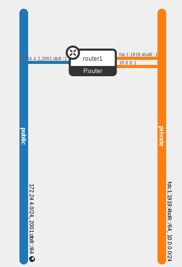
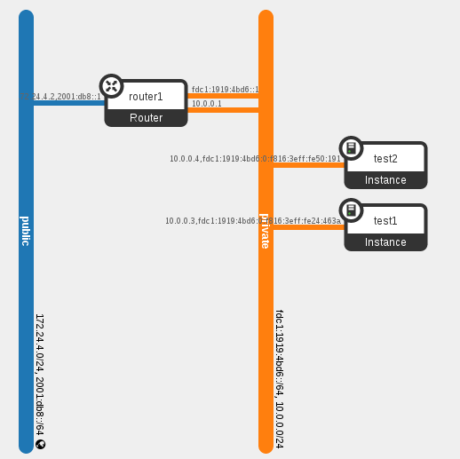

When Ben Pfaff [pushed the last of the changes needed to make OVN functional](http://openvswitch.org/pipermail/dev/2015-May/055054.html) to the ovn branch, he dubbed it the "EZ Bake milestone".  The analogy is both humorous and somewhat accurate.  We've reached the first functional milestone, which is quite exciting.

[](https://russellbryantnet.files.wordpress.com/2015/05/ovn-m0.png)In previous posts I have gone through and shown components of the system as it has been built.  Now that it's functional, I will go through a working demonstration of OpenStack using OVN.

## DevStack

For this test environment we'll stand up two hosts using [DevStack](http://git.openstack.org/cgit/openstack-dev/devstack).  Both hosts will be VMs running Fedora 21 that have 2 vCPUs and 4 GB of RAM.  We will refer to them as `ovn-devstack-1` and `ovn-devstack-2`.

Each VM needs to have git installed and a user created that has sudo access.  This user will be used run DevStack.

### Setting up ovn-devstack-1

The first DevStack host will look like a typical single node DevStack install that runs all of OpenStack.  It will be using OVN to provide L2 network connectivity instead of the default OVS ML2 driver and the neutron OVS agent.  It will still make use of the L3 and DHCP agents from Neutron as the equivalent functionality has not yet been implemented in OVN.

Start by cloning DevStack and networking-ovn:
```
(ovn-devstack-1)$ git clone http://git.openstack.org/openstack-dev/devstack.git
(ovn-devstack-1)$ git clone http://git.openstack.org/openstack/networking-ovn.git
```
networking-ovn comes with some sample configuration files for DevStack.  We can use the main sample for this host without any modifications needed.
```
(ovn-devstack-1)$ cd devstack
(ovn-devstack-1)$ cp ../networking-ovn/devstack/local.conf.sample local.conf
```
After the DevStack configuration is in place, run DevStack to set up the environment.
```
(ovn-devstack-1)$ ./stack.sh
```
This takes several minutes to complete.  Once it has completed successfully, you should see some output that looks like this:
```
This is your host ip: 172.16.189.6
Horizon is now available at http://172.16.189.6/
Keystone is serving at http://172.16.189.6:5000/
The default users are: admin and demo
The password: password
2015-05-13 18:59:48.169 | stack.sh completed in 989 seconds.
```

### Setting up ovn-devstack-2

The second DevStack host runs a minimal set of services needed to add an additional compute node (or hypervisor) to the existing DevStack environment.  It needs to run the OpenStack `nova-compute` service for managing local VMs and `ovn-controller` to manage the local ovs configuration.

Setting up the second DevStack host is a very similar process.  Start by cloning DevStack and networking-ovn.
```
(ovn-devstack-2)$ git clone http://git.openstack.org/openstack-dev/devstack.git
(ovn-devstack-2)$ git clone http://git.openstack.org/openstack/networking-ovn.git
```
networking-ovn provides an additional sample configuration file for DevStack that is intended to be used for adding additional compute nodes to an existing DevStack environment.  You must set the `SERVICE_HOST` configuration variable in this file to be the IP address of the main DevStack host.
```
(ovn-devstack-2)$ cd devstack
(ovn-devstack-2)$ cp ../networking-ovn/devstack/computenode-local.conf.sample local.conf
(ovn-devstack-2)$ vim local.conf
... edit to set SERVICE_HOST=172.16.189.6 in this example ...
```
Once the DevStack configuration is ready, you can run DevStack to set up the new compute node.  It should take less time to complete than the first DevStack host.
```
(ovn-devstack-2)$ ./stack.sh
```
Once it completes, you should see output that looks like this:
```
This is your host ip: 172.16.189.10
2015-05-13 19:02:30.663 | stack.sh completed in 98 seconds.
```

## The Default Environment

DevStack is now running on two hosts.  Let's take a look at the default state of this environment before we start creating VMs.  We'll run various OpenStack command line tools to interact with the OpenStack APIs.  By default, these tools get credentials from environment variables.  DevStack comes with a file called `openrc` that makes it easy to switch between `admin` (the cloud administrator) and `demo` (a regular cloud user) credentials.

We can start by making sure that Nova sees two hypervisors.  This API requires admin credentials.
```
(ovn-devstack-1)$ cd devstack
(ovn-devstack-1)$ . openrc admin
(ovn-devstack-1)$ nova hypervisor-list
+----+------------------------------------+-------+---------+
| ID | Hypervisor hostname                | State | Status  |
+----+------------------------------------+-------+---------+
| 1  | ovn-devstack-1.os1.phx2.redhat.com | up    | enabled |
| 2  | ovn-devstack-2.os1.phx2.redhat.com | up    | enabled |
+----+------------------------------------+-------+---------+

```
DevStack also has a default network configuration.  We can use the `neutron` command line tool to list the default networks.
```
(ovn-devstack-1)$ . openrc admin
(ovn-devstack-1)$ neutron net-list
+--------------------------------------+---------+----------------------------------------------------------+
| id                                   | name    | subnets                                                  |
+--------------------------------------+---------+----------------------------------------------------------+
| 7e78ba86-2114-47ac-8194-201936e3820a | public  | ebfe46b4-e0ab-4cda-b2ee-5bb1761b5995 172.24.4.0/24       |
|                                      |         | b435f473-bed1-41bf-9110-797424364016 2001:db8::/64       |
| cfc9ff50-4435-4b29-bf2e-c27dd6cf5a5e | private | 74056863-9d45-452a-a431-344a33cf517b fdc1:1919:4bd6::/64 |
|                                      |         | d5ad74d7-7bd9-4646-add2-e816cfee1ec3 10.0.0.0/24         |
+--------------------------------------+---------+----------------------------------------------------------+

```
The Horizon web interface also provides a visual representation of the network topology:

[](https://russellbryantnet.files.wordpress.com/2015/05/default-topology.png)

The default environment also creates four Neutron ports.  Three are related to the router and can be seen in the diagram above.  The fourth (not shown) is for the DHCP agent providing DHCP services to the `private` network.
```
$ neutron port-list
+--------------------------------------+------+-------------------+-------------------------------------------------------------------------------------------------------------+
| id                                   | name | mac_address       | fixed_ips                                                                                                   |
+--------------------------------------+------+-------------------+-------------------------------------------------------------------------------------------------------------+
| 381a2d96-bc4a-4785-82bc-4f2b48e007e8 |      | fa:16:3e:76:12:96 | {"subnet_id": "d5ad74d7-7bd9-4646-add2-e816cfee1ec3", "ip_address": "10.0.0.2"}                             |
|                                      |      |                   | {"subnet_id": "74056863-9d45-452a-a431-344a33cf517b", "ip_address": "fdc1:1919:4bd6:0:f816:3eff:fe76:1296"} |
| a5b967d4-296e-44dc-98b9-7336d0224e57 |      | fa:16:3e:8c:d0:a8 | {"subnet_id": "ebfe46b4-e0ab-4cda-b2ee-5bb1761b5995", "ip_address": "172.24.4.2"}                           |
|                                      |      |                   | {"subnet_id": "b435f473-bed1-41bf-9110-797424364016", "ip_address": "2001:db8::1"}                          |
| b2e0ae9e-d472-42ed-8776-6b338349d01d |      | fa:16:3e:b7:cd:77 | {"subnet_id": "74056863-9d45-452a-a431-344a33cf517b", "ip_address": "fdc1:1919:4bd6::1"}                    |
| f24756f3-d803-47d3-9fc7-1315f4071ac0 |      | fa:16:3e:b1:34:ed | {"subnet_id": "d5ad74d7-7bd9-4646-add2-e816cfee1ec3", "ip_address": "10.0.0.1"}                             |
+--------------------------------------+------+-------------------+-------------------------------------------------------------------------------------------------------------+

```
These default networks and ports can also be seen in OVN. OVN has a northbound database (`OVN_Northbound`) that serves as the public interface to OVN.  The Neutron driver updates this database to indicate the desired state.  OVN comes with a command line utility, `ovn-nbctl`, which can be used to view or update the `OVN_Northbound` database.  The `show` command gives a summary of the current configuration.
```
(ovn-devstack-1)$ ovn-nbctl show
    lswitch f8e8c67c-ce4a-4f23-a01b-0eb31b4ab3e2 (neutron-7e78ba86-2114-47ac-8194-201936e3820a)
        lport a5b967d4-296e-44dc-98b9-7336d0224e57
            macs: fa:16:3e:8c:d0:a8
    lswitch bd7dbbf9-1325-491f-b46b-80b4ecfc560b (neutron-cfc9ff50-4435-4b29-bf2e-c27dd6cf5a5e)
        lport f24756f3-d803-47d3-9fc7-1315f4071ac0
            macs: fa:16:3e:b1:34:ed
        lport 381a2d96-bc4a-4785-82bc-4f2b48e007e8
            macs: fa:16:3e:76:12:96
        lport b2e0ae9e-d472-42ed-8776-6b338349d01d
            macs: fa:16:3e:b7:cd:77

```

## Launching VMs

Now that the environment is ready, we can start launching VMs.  We will launch two VMs so that one will end up on each of our compute nodes.  We'll verify that the data path is working and then inspect what OVN has done to make it work.

We want our VMs to have a single vNIC attached to the `private` Neutron network.
```
(ovn-devstack-1)$ . openrc demo
(ovn-devstack-1)$ neutron net-list
+--------------------------------------+---------+----------------------------------------------------------+
| id                                   | name    | subnets                                                  |
+--------------------------------------+---------+----------------------------------------------------------+
| 7e78ba86-2114-47ac-8194-201936e3820a | public  | ebfe46b4-e0ab-4cda-b2ee-5bb1761b5995                     |
|                                      |         | b435f473-bed1-41bf-9110-797424364016                     |
| cfc9ff50-4435-4b29-bf2e-c27dd6cf5a5e | private | 74056863-9d45-452a-a431-344a33cf517b fdc1:1919:4bd6::/64 |
|                                      |         | d5ad74d7-7bd9-4646-add2-e816cfee1ec3 10.0.0.0/24         |
+--------------------------------------+---------+----------------------------------------------------------+

(ovn-devstack-1)$ PRIVATE_NET_ID=cfc9ff50-4435-4b29-bf2e-c27dd6cf5a5e

```
DevStack automatically imports a very small test image, CirrOS, which suits our needs.
```
(ovn-devstack-1)$ glance image-list
+--------------------------------------+---------------------------------+-------------+------------------+----------+--------+
| ID                                   | Name                            | Disk Format | Container Format | Size     | Status |
+--------------------------------------+---------------------------------+-------------+------------------+----------+--------+
| 4d9443ee-1497-4bb3-b917-2e35b0e59eab | cirros-0.3.4-x86_64-uec         | ami         | ami              | 25165824 | active |
| ab38e2d2-8397-4ece-8aa3-9a3058e63029 | cirros-0.3.4-x86_64-uec-kernel  | aki         | aki              | 4979632  | active |
| 38721471-6a19-45f7-8c8d-fd64b7737fd7 | cirros-0.3.4-x86_64-uec-ramdisk | ari         | ari              | 3740163  | active |
+--------------------------------------+---------------------------------+-------------+------------------+----------+--------+

(ovn-devstack-1)$ IMAGE_ID=4d9443ee-1497-4bb3-b917-2e35b0e59eab

```
We'll use the `m1.nano` flavor, as minimal resources are sufficient for our testing with these VMs.
```
(ovn-devstack-1)$ nova flavor-list
+----+-----------+-----------+------+-----------+------+-------+-------------+-----------+
| ID | Name      | Memory_MB | Disk | Ephemeral | Swap | VCPUs | RXTX_Factor | Is_Public |
+----+-----------+-----------+------+-----------+------+-------+-------------+-----------+
| 1  | m1.tiny   | 512       | 1    | 0         |      | 1     | 1.0         | True      |
| 2  | m1.small  | 2048      | 20   | 0         |      | 1     | 1.0         | True      |
| 3  | m1.medium | 4096      | 40   | 0         |      | 2     | 1.0         | True      |
| 4  | m1.large  | 8192      | 80   | 0         |      | 4     | 1.0         | True      |
| 42 | m1.nano   | 64        | 0    | 0         |      | 1     | 1.0         | True      |
| 5  | m1.xlarge | 16384     | 160  | 0         |      | 8     | 1.0         | True      |
| 84 | m1.micro  | 128       | 0    | 0         |      | 1     | 1.0         | True      |
+----+-----------+-----------+------+-----------+------+-------+-------------+-----------+

(ovn-devstack-1)$ FLAVOR_ID=42

```
We also need to create an SSH keypair for logging in to the VMs we create.
```
(ovn-devstack-1)$ nova keypair-add demo > id_rsa_demo
(ovn-devstack-1)$ chmod 600 id_rsa_demo

```
We now have everything needed to boot some VMs. We'll create two of them, named `test1` and `test2`.
```
(ovn-devstaqck-1)$ nova boot --nic net-id=$PRIVATE_NET_ID --image $IMAGE_ID --flavor $FLAVOR_ID --key-name demo test1
+--------------------------------------+----------------------------------------------------------------+
| Property                             | Value                                                          |
+--------------------------------------+----------------------------------------------------------------+
| OS-DCF:diskConfig                    | MANUAL                                                         |
| OS-EXT-AZ:availability_zone          | nova                                                           |
| OS-EXT-STS:power_state               | 0                                                              |
| OS-EXT-STS:task_state                | scheduling                                                     |
| OS-EXT-STS:vm_state                  | building                                                       |
| OS-SRV-USG:launched_at               | - |
| OS-SRV-USG:terminated_at             | - |
| accessIPv4                           |                                                                |
| accessIPv6                           |                                                                |
| adminPass                            | 9NMJrLeCDPJv                                                   |
| config_drive                         |                                                                |
| created                              | 2015-05-14T13:33:55Z                                           |
| flavor                               | m1.nano (42)                                                   |
| hostId                               |                                                                |
| id                                   | d91cf422-fe2e-4131-bc49-2f310daa5cf0                           |
| image                                | cirros-0.3.4-x86_64-uec (4d9443ee-1497-4bb3-b917-2e35b0e59eab) |
| key_name                             | demo                                                           |
| metadata                             | {}                                                             |
| name                                 | test1                                                          |
| os-extended-volumes:volumes_attached | []                                                             |
| progress                             | 0                                                              |
| security_groups                      | default                                                        |
| status                               | BUILD                                                          |
| tenant_id                            | 92fbf8554b2246c5bb9b0db0be55529c                               |
| updated                              | 2015-05-14T13:33:56Z                                           |
| user_id                              | 207b4e55a2684f20a2a21e14c28dffed                               |
+--------------------------------------+----------------------------------------------------------------+

(ovn-devstack-1)$ nova boot --nic net-id=$PRIVATE_NET_ID --image $IMAGE_ID --flavor $FLAVOR_ID --key-name demo test2
+--------------------------------------+----------------------------------------------------------------+
| Property                             | Value                                                          |
+--------------------------------------+----------------------------------------------------------------+
| OS-DCF:diskConfig                    | MANUAL                                                         |
| OS-EXT-AZ:availability_zone          | nova                                                           |
| OS-EXT-STS:power_state               | 0                                                              |
| OS-EXT-STS:task_state                | scheduling                                                     |
| OS-EXT-STS:vm_state                  | building                                                       |
| OS-SRV-USG:launched_at               | - |
| OS-SRV-USG:terminated_at             | - |
| accessIPv4                           |                                                                |
| accessIPv6                           |                                                                |
| adminPass                            | BgL89P2oKotD                                                   |
| config_drive                         |                                                                |
| created                              | 2015-05-14T13:34:47Z                                           |
| flavor                               | m1.nano (42)                                                   |
| hostId                               |                                                                |
| id                                   | 4da9dd8e-4583-4955-94b1-0f9eaf77663c                           |
| image                                | cirros-0.3.4-x86_64-uec (4d9443ee-1497-4bb3-b917-2e35b0e59eab) |
| key_name                             | demo                                                           |
| metadata                             | {}                                                             |
| name                                 | test2                                                          |
| os-extended-volumes:volumes_attached | []                                                             |
| progress                             | 0                                                              |
| security_groups                      | default                                                        |
| status                               | BUILD                                                          |
| tenant_id                            | 92fbf8554b2246c5bb9b0db0be55529c                               |
| updated                              | 2015-05-14T13:34:48Z                                           |
| user_id                              | 207b4e55a2684f20a2a21e14c28dffed                               |
+--------------------------------------+----------------------------------------------------------------+

```
We can use admin credentials to see which hypervisor each VM ended up on. This is just to show that we now have an environment with two VMs on the `private` Neutron virtual network that spans two hypervisors.
```
(ovn-devstack-1)$ . openrc admin
(ovn-devstack-1)$ nova show test1 | grep hypervisor_hostname
| OS-EXT-SRV-ATTR:hypervisor_hostname  | ovn-devstack-1.os1.phx2.redhat.com

(ovn-devstack-1)$ nova show test2 | grep hypervisor_hostname
| OS-EXT-SRV-ATTR:hypervisor_hostname  | ovn-devstack-2.os1.phx2.redhat.com

```
When we first issue the boot requests, the status of each VM was `BUILD`. Once the VM is running on the hypervisor, it will switch to the `ACTIVE` status.
```
(ovn-devstack-1)$ . openrc demo
(ovn-devstack-1)$ nova list --fields name,status,networks
+--------------------------------------+-------+--------+--------------------------------------------------------+
| ID                                   | Name  | Status | Networks                                               |
+--------------------------------------+-------+--------+--------------------------------------------------------+
| d91cf422-fe2e-4131-bc49-2f310daa5cf0 | test1 | ACTIVE | private=fdc1:1919:4bd6:0:f816:3eff:fe24:463a, 10.0.0.3 |
| 4da9dd8e-4583-4955-94b1-0f9eaf77663c | test2 | ACTIVE | private=fdc1:1919:4bd6:0:f816:3eff:fe50:191, 10.0.0.4  |
+--------------------------------------+-------+--------+--------------------------------------------------------+
```

## Testing and Inspecting the Network

Our two new VMs has resulted in two more Neutron ports being created.  This is shown in Horizon's visual representation of the network topology:

[](https://russellbryantnet.files.wordpress.com/2015/05/topology-2-vms.png)

We can also get all of the details from the Neutron API:
```
(ovn-devstack-1)$ . openrc admin
(ovn-devstack-1)$ neutron port-list
+--------------------------------------+------+-------------------+-------------------------------------------------------------------------------------------------------------+
| id                                   | name | mac_address       | fixed_ips                                                                                                   |
+--------------------------------------+------+-------------------+-------------------------------------------------------------------------------------------------------------+
| 10964198-b218-417e-a59e-6a6d7096c936 |      | fa:16:3e:50:01:91 | {"subnet_id": "d5ad74d7-7bd9-4646-add2-e816cfee1ec3", "ip_address": "10.0.0.4"}                             |
|                                      |      |                   | {"subnet_id": "74056863-9d45-452a-a431-344a33cf517b", "ip_address": "fdc1:1919:4bd6:0:f816:3eff:fe50:191"}  |
| 381a2d96-bc4a-4785-82bc-4f2b48e007e8 |      | fa:16:3e:76:12:96 | {"subnet_id": "d5ad74d7-7bd9-4646-add2-e816cfee1ec3", "ip_address": "10.0.0.2"}                             |
|                                      |      |                   | {"subnet_id": "74056863-9d45-452a-a431-344a33cf517b", "ip_address": "fdc1:1919:4bd6:0:f816:3eff:fe76:1296"} |
| a5b967d4-296e-44dc-98b9-7336d0224e57 |      | fa:16:3e:8c:d0:a8 | {"subnet_id": "ebfe46b4-e0ab-4cda-b2ee-5bb1761b5995", "ip_address": "172.24.4.2"}                           |
|                                      |      |                   | {"subnet_id": "b435f473-bed1-41bf-9110-797424364016", "ip_address": "2001:db8::1"}                          |
| a7a8ee94-996e-4623-941c-1ef7b7862f6e |      | fa:16:3e:24:46:3a | {"subnet_id": "d5ad74d7-7bd9-4646-add2-e816cfee1ec3", "ip_address": "10.0.0.3"}                             |
|                                      |      |                   | {"subnet_id": "74056863-9d45-452a-a431-344a33cf517b", "ip_address": "fdc1:1919:4bd6:0:f816:3eff:fe24:463a"} |
| b2e0ae9e-d472-42ed-8776-6b338349d01d |      | fa:16:3e:b7:cd:77 | {"subnet_id": "74056863-9d45-452a-a431-344a33cf517b", "ip_address": "fdc1:1919:4bd6::1"}                    |
| f24756f3-d803-47d3-9fc7-1315f4071ac0 |      | fa:16:3e:b1:34:ed | {"subnet_id": "d5ad74d7-7bd9-4646-add2-e816cfee1ec3", "ip_address": "10.0.0.1"}                             |
+--------------------------------------+------+-------------------+-------------------------------------------------------------------------------------------------------------+

```

### The Ping Test

Now let's verify that the network seems to work as we expect.  In this environment we can connect to the `private` Network from `ovn-devstack-1`. We can start with a quick check that we can ping both VMs and also that we can ping from one VM to the other.
```
(ovn-devstack-1)$ ping -c 1 10.0.0.3
PING 10.0.0.3 (10.0.0.3) 56(84) bytes of data.
64 bytes from 10.0.0.3: icmp_seq=1 ttl=63 time=2.90 ms

(ovn-devstack-1)$ ping -c 1 10.0.0.4
PING 10.0.0.4 (10.0.0.4) 56(84) bytes of data.
64 bytes from 10.0.0.4: icmp_seq=1 ttl=63 time=3.87 ms

(ovn-devstack-1)$ ssh -i id_rsa_demo cirros@10.0.0.3
(test1)$ ping -c 1 10.0.0.4
PING 10.0.0.4 (10.0.0.4): 56 data bytes
64 bytes from 10.0.0.4: seq=0 ttl=64 time=2.945 ms

```
**It works!**

### OVN Northbound Database

Now let's take a closer look at what OVN has done to make this work. We looked at the `OVN_Northbound` database earlier. It now includes the two additional ports for the VMs in its configuration for the `private` virtual network.
```
(ovn-devstack-1)$ ovn-nbctl show
$ ovn-nbctl show
    lswitch f8e8c67c-ce4a-4f23-a01b-0eb31b4ab3e2 (neutron-7e78ba86-2114-47ac-8194-201936e3820a)
        lport a5b967d4-296e-44dc-98b9-7336d0224e57
            macs: fa:16:3e:8c:d0:a8
    lswitch bd7dbbf9-1325-491f-b46b-80b4ecfc560b (neutron-cfc9ff50-4435-4b29-bf2e-c27dd6cf5a5e)
        lport f24756f3-d803-47d3-9fc7-1315f4071ac0
            macs: fa:16:3e:b1:34:ed
        lport 10964198-b218-417e-a59e-6a6d7096c936
            macs: fa:16:3e:50:01:91
        lport 381a2d96-bc4a-4785-82bc-4f2b48e007e8
            macs: fa:16:3e:76:12:96
        lport b2e0ae9e-d472-42ed-8776-6b338349d01d
            macs: fa:16:3e:b7:cd:77
        lport a7a8ee94-996e-4623-941c-1ef7b7862f6e
            macs: fa:16:3e:24:46:3a

```
When we requested a new VM from Nova, Nova asked Neutron to create a new port on the network we specified. As the port was created, the Neutron OVN driver added this entry to the `OVN_Northbound` database. The northbound database is the desired state of the system. As it gets changed, the rest of OVN gets to work to implement the change.

### OVN Chassis

OVN has a second database, `OVN_Southbound`, that is used internally to track the current state of the system. The `Chassis` table of `OVN_Southbound` is used to keep track of the different hypervisors running `ovn-controller` and how to connect to them. When `ovn-controller` starts, it registers itself in this table.
```
(ovn-devstack-1)$ ovsdb-client dump OVN_Southbound
...
Chassis table
_uuid                                encaps                                 gateway_ports name                                  
------------------------------------ -------------------------------------- ------------- --------------------------------------
4979df20-56a8-4c74-a499-d2409acb05cc [a59cbc44-b998-4a13-98b4-bc02c79d4d1e] {}            "2a33c976-54ec-4f62-878e-863eea3edcf5"
f58f3955-3dc4-4f79-8d4d-e0250a01a850 [d1e19aec-0e8a-4338-b1d7-eb83dfe197e8] {}            "b29ae352-588f-45bc-aefe-ba15bf2f889b"

Encap table
_uuid                                ip              options type  
------------------------------------ --------------- ------- ------
a59cbc44-b998-4a13-98b4-bc02c79d4d1e "172.16.189.10" {}      geneve
d1e19aec-0e8a-4338-b1d7-eb83dfe197e8 "172.16.189.6"  {}      geneve
...

```

### OVN Bindings

As logical ports get added to `OVN_Northbound`, the `ovn-northd` service creates entries in the `Binding` table of `OVN_Southbound`. This table is used to keep track of which physical chassis a logical port resides on. At first, the `chassis` column is empty. Once `ovn-controller` sees a port plugged into the local `br-int` with an `iface-id` that matches a logical port, `ovn-controller` will update the `chassis` column of that logical port's `Binding` row to reflect that the port resides on that chassis.
```
(ovn-devstack-1)$ ovsdb-client dump OVN_Southbound
...
Binding table
_uuid                                chassis                                logical_datapath                     logical_port                           mac                   parent_port tag tunnel_key
------------------------------------ -------------------------------------- ------------------------------------ -------------------------------------- --------------------- ----------- --- ----------
977a249e-3ec4-4d7c-a7bb-e751415ee4b1 ""                                     f8e8c67c-ce4a-4f23-a01b-0eb31b4ab3e2 "a5b967d4-296e-44dc-98b9-7336d0224e57" ["fa:16:3e:8c:d0:a8"] []          []  3         
2e213a46-e52c-4e46-ac48-2de9bc5c56a4 "2a33c976-54ec-4f62-878e-863eea3edcf5" bd7dbbf9-1325-491f-b46b-80b4ecfc560b "10964198-b218-417e-a59e-6a6d7096c936" ["fa:16:3e:50:01:91"] []          []  6         
4cd9430e-0735-4e63-b5b2-25a666649f4e "b29ae352-588f-45bc-aefe-ba15bf2f889b" bd7dbbf9-1325-491f-b46b-80b4ecfc560b "381a2d96-bc4a-4785-82bc-4f2b48e007e8" ["fa:16:3e:76:12:96"] []          []  1         
23fc5778-5a00-4e3f-b1e7-4c37c999a378 "b29ae352-588f-45bc-aefe-ba15bf2f889b" bd7dbbf9-1325-491f-b46b-80b4ecfc560b "a7a8ee94-996e-4623-941c-1ef7b7862f6e" ["fa:16:3e:24:46:3a"] []          []  5         
744a141e-8f02-4783-8cbe-af13992f74f7 "b29ae352-588f-45bc-aefe-ba15bf2f889b" bd7dbbf9-1325-491f-b46b-80b4ecfc560b "b2e0ae9e-d472-42ed-8776-6b338349d01d" ["fa:16:3e:b7:cd:77"] []          []  4         
225cc721-7c59-4466-872b-02f5e61efe56 "b29ae352-588f-45bc-aefe-ba15bf2f889b" bd7dbbf9-1325-491f-b46b-80b4ecfc560b "f24756f3-d803-47d3-9fc7-1315f4071ac0" ["fa:16:3e:b1:34:ed"] []          []  2         
...

```

### OVN Pipeline

Another function of the `ovn-northd` service is defining the contents of the `Pipeline` table in the `OVN_Southbound` database. Each row in the `Pipeline` table represents a logical flow. `ovn-controller` on each chassis is responsible for converting the logical flows into OpenFlow flows appropriate for that node. We will go through annotated `Pipeline` contents for the current configuration. The output has been reordered to make it easier to follow. It's sorted by datapath (the logical switch the flows are associated with), then table\_id, then priority.

The `Pipeline` table has a similar format to OpenFlow. For each logical datapath (logical switch), processing starts at the highest priority match in table 0. A complete description of the syntax for the `Pipeline` table can be found in the [ovn-sb](https://github.com/openvswitch/ovs/blob/ovn/ovn/ovn-sb.xml) document.
```
(ovn-devstack-1)$ ovsdb-client dump OVN_Southbound
...
Pipeline table
_uuid                                actions                                                                                                                                                                                                                                                                                             logical_datapath                     match                                                                                   priority table_id
------------------------------------ --------------------------------------------------------------------------------------------------------------------------------------------------------------------------------------------------------------------------------------------------------------------------------------------------- ------------------------------------ --------------------------------------------------------------------------------------- -------- --------
...

```
Table 0 starts by dropping anything with an invalid source MAC address. It also says to drop anything with a logical vlan tag, because there's no concept of logical vlans.
```
_uuid                                actions                                                                                                                                                                                                                                                                                             logical_datapath                     match                                                                                   priority table_id
------------------------------------ --------------------------------------------------------------------------------------------------------------------------------------------------------------------------------------------------------------------------------------------------------------------------------------------------- ------------------------------------ --------------------------------------------------------------------------------------- -------- --------
9bbe8795-d093-4c9b-a712-1c7b8e953ae7 "drop;"                                                                                                                                                                                                                                                                                             bd7dbbf9-1325-491f-b46b-80b4ecfc560b "eth.src[40]"                                                                           100      0       
71af3be1-b0b7-4e5a-aadb-c510907bfabd "drop;"                                                                                                                                                                                                                                                                                             bd7dbbf9-1325-491f-b46b-80b4ecfc560b vlan.present                                                                            100      0       

```
The next 5 rows correspond to the five logical ports on this logical network. If the packet came in from one of the logical ports and its source MAC address is one that is allowed, processing will continue in table 1.
```
_uuid                                actions                                                                                                                                                                                                                                                                                             logical_datapath                     match                                                                                   priority table_id
------------------------------------ --------------------------------------------------------------------------------------------------------------------------------------------------------------------------------------------------------------------------------------------------------------------------------------------------- ------------------------------------ --------------------------------------------------------------------------------------- -------- --------
914eab89-b327-4a7d-ad88-08d2e4be104c "next;"                                                                                                                                                                                                                                                                                             bd7dbbf9-1325-491f-b46b-80b4ecfc560b "inport == \"10964198-b218-417e-a59e-6a6d7096c936\" && eth.src == {fa:16:3e:50:01:91}"  50       0       
2f80e9b3-a2db-4160-9d94-598960160cfb "next;"                                                                                                                                                                                                                                                                                             bd7dbbf9-1325-491f-b46b-80b4ecfc560b "inport == \"381a2d96-bc4a-4785-82bc-4f2b48e007e8\" && eth.src == {fa:16:3e:76:12:96}"  50       0       
a761a821-9cc3-49d1-a00b-b2eabd242480 "next;"                                                                                                                                                                                                                                                                                             bd7dbbf9-1325-491f-b46b-80b4ecfc560b "inport == \"a7a8ee94-996e-4623-941c-1ef7b7862f6e\" && eth.src == {fa:16:3e:24:46:3a}"  50       0       
6b0675e9-9c09-48c3-8cbd-c0da0fd9f608 "next;"                                                                                                                                                                                                                                                                                             bd7dbbf9-1325-491f-b46b-80b4ecfc560b "inport == \"b2e0ae9e-d472-42ed-8776-6b338349d01d\" && eth.src == {fa:16:3e:b7:cd:77}"  50       0       
b6fb9eb2-3047-4231-9131-88f34d56ff77 "next;"                                                                                                                                                                                                                                                                                             bd7dbbf9-1325-491f-b46b-80b4ecfc560b "inport == \"f24756f3-d803-47d3-9fc7-1315f4071ac0\" && eth.src == {fa:16:3e:b1:34:ed}"  50       0       

```
Finally, if the packet did not patch any higher priority flows, it just gets dropped.
```
_uuid                                actions                                                                                                                                                                                                                                                                                             logical_datapath                     match                                                                                   priority table_id
------------------------------------ --------------------------------------------------------------------------------------------------------------------------------------------------------------------------------------------------------------------------------------------------------------------------------------------------- ------------------------------------ --------------------------------------------------------------------------------------- -------- --------
14e02175-d6ab-4a7c-bf30-7774ecf8074c "drop;"                                                                                                                                                                                                                                                                                             bd7dbbf9-1325-491f-b46b-80b4ecfc560b "1"                                                                                     0        0       

```
The highest priority flow in table 1 matches packets with a broadcast destination MAC address. In that case, processing continues in table 2 several times (once for each logical port on this network) with the `outport` variable set.
```
_uuid                                actions                                                                                                                                                                                                                                                                                             logical_datapath                     match                                                                                   priority table_id
------------------------------------ --------------------------------------------------------------------------------------------------------------------------------------------------------------------------------------------------------------------------------------------------------------------------------------------------- ------------------------------------ --------------------------------------------------------------------------------------- -------- --------
d4adaf36-f63f-4c04-b37b-63399b5b9459 "outport = \"10964198-b218-417e-a59e-6a6d7096c936\"; next; outport = \"381a2d96-bc4a-4785-82bc-4f2b48e007e8\"; next; outport = \"f24756f3-d803-47d3-9fc7-1315f4071ac0\"; next; outport = \"b2e0ae9e-d472-42ed-8776-6b338349d01d\"; next; outport = \"a7a8ee94-996e-4623-941c-1ef7b7862f6e\"; next;" bd7dbbf9-1325-491f-b46b-80b4ecfc560b "eth.dst[40]"                                                                           100      1       

```
The next 5 flows match when the destination MAC address is a MAC address assigned to one of the logical ports. In that case, the `outport` variable gets set and processing continues in table 2.
```
_uuid                                actions                                                                                                                                                                                                                                                                                             logical_datapath                     match                                                                                   priority table_id
------------------------------------ --------------------------------------------------------------------------------------------------------------------------------------------------------------------------------------------------------------------------------------------------------------------------------------------------- ------------------------------------ --------------------------------------------------------------------------------------- -------- --------
22e05122-a917-4fd5-804f-b8dc6e48d334 "outport = \"10964198-b218-417e-a59e-6a6d7096c936\"; next;"                                                                                                                                                                                                                                         bd7dbbf9-1325-491f-b46b-80b4ecfc560b "eth.dst == fa:16:3e:50:01:91"                                                          50       1       
b444b9f2-4924-4d4c-bc92-c44b86fb7fc2 "outport = \"381a2d96-bc4a-4785-82bc-4f2b48e007e8\"; next;"                                                                                                                                                                                                                                         bd7dbbf9-1325-491f-b46b-80b4ecfc560b "eth.dst == fa:16:3e:76:12:96"                                                          50       1       
a2fe2a1a-6b44-4255-bda0-0b665c2bfafc "outport = \"a7a8ee94-996e-4623-941c-1ef7b7862f6e\"; next;"                                                                                                                                                                                                                                         bd7dbbf9-1325-491f-b46b-80b4ecfc560b "eth.dst == fa:16:3e:24:46:3a"                                                          50       1       
834f9f4b-999b-4445-b7ae-3e912c97cbe7 "outport = \"b2e0ae9e-d472-42ed-8776-6b338349d01d\"; next;"                                                                                                                                                                                                                                         bd7dbbf9-1325-491f-b46b-80b4ecfc560b "eth.dst == fa:16:3e:b7:cd:77"                                                          50       1       
dcd4f6c2-627a-4441-927a-feedcf2295cb "outport = \"f24756f3-d803-47d3-9fc7-1315f4071ac0\"; next;"                                                                                                                                                                                                                                         bd7dbbf9-1325-491f-b46b-80b4ecfc560b "eth.dst == fa:16:3e:b1:34:ed"                                                          50       1       

```
Table 2 does nothing important in this environment. It will eventually be used to implement ACLs. In the context of Neutron, security groups will get translated into OVN ACLs and those ACLs will be reflected by flow entries in this table.
```
_uuid                                actions                                                                                                                                                                                                                                                                                             logical_datapath                     match                                                                                   priority table_id
------------------------------------ --------------------------------------------------------------------------------------------------------------------------------------------------------------------------------------------------------------------------------------------------------------------------------------------------- ------------------------------------ --------------------------------------------------------------------------------------- -------- --------
325b6008-7cfd-480f-8b15-d9d42dfff567 "next;"                                                                                                                                                                                                                                                                                             bd7dbbf9-1325-491f-b46b-80b4ecfc560b "1"                                                                                     0        2       

```
Table 3 is the final table. The first flow matches a broadcast destination MAC address. The action is `output;`, which means to output the packet to the logical port identified by the `outport` variable.
```
_uuid                                actions                                                                                                                                                                                                                                                                                             logical_datapath                     match                                                                                   priority table_id
------------------------------------ --------------------------------------------------------------------------------------------------------------------------------------------------------------------------------------------------------------------------------------------------------------------------------------------------- ------------------------------------ --------------------------------------------------------------------------------------- -------- --------
70c9b568-0e8d-4592-904d-4f5b0c7ca606 "output;"                                                                                                                                                                                                                                                                                           bd7dbbf9-1325-491f-b46b-80b4ecfc560b "eth.dst[40]"                                                                           100      3       

```
The following 5 flows are associated with the 5 logical ports on this network. They will match if the `outport` variable matches a logical port and the destination MAC address is in the set of allowed MAC addresses.
```
_uuid                                actions                                                                                                                                                                                                                                                                                             logical_datapath                     match                                                                                   priority table_id
------------------------------------ --------------------------------------------------------------------------------------------------------------------------------------------------------------------------------------------------------------------------------------------------------------------------------------------------- ------------------------------------ --------------------------------------------------------------------------------------- -------- --------
1d6f7f7f-f3ac-409c-9dda-f55b0fd4c6da "output;"                                                                                                                                                                                                                                                                                           bd7dbbf9-1325-491f-b46b-80b4ecfc560b "outport == \"10964198-b218-417e-a59e-6a6d7096c936\" && eth.dst == {fa:16:3e:50:01:91}" 50       3       
730a39c1-93ea-41a1-81e2-a8f08f011981 "output;"                                                                                                                                                                                                                                                                                           bd7dbbf9-1325-491f-b46b-80b4ecfc560b "outport == \"381a2d96-bc4a-4785-82bc-4f2b48e007e8\" && eth.dst == {fa:16:3e:76:12:96}" 50       3       
9b83c397-1d24-4446-a201-c56eec8cb9ba "output;"                                                                                                                                                                                                                                                                                           bd7dbbf9-1325-491f-b46b-80b4ecfc560b "outport == \"a7a8ee94-996e-4623-941c-1ef7b7862f6e\" && eth.dst == {fa:16:3e:24:46:3a}" 50       3       
f37cc0d7-e69a-4f45-b8ef-595c25b5c62b "output;"                                                                                                                                                                                                                                                                                           bd7dbbf9-1325-491f-b46b-80b4ecfc560b "outport == \"b2e0ae9e-d472-42ed-8776-6b338349d01d\" && eth.dst == {fa:16:3e:b7:cd:77}" 50       3       
5ec90c56-fe85-4199-ad30-f0f32ee2b8da "output;"                                                                                                                                                                                                                                                                                           bd7dbbf9-1325-491f-b46b-80b4ecfc560b "outport == \"f24756f3-d803-47d3-9fc7-1315f4071ac0\" && eth.dst == {fa:16:3e:b1:34:ed}" 50       3       

```
All of the flows above are associated with the `private` network. These flows follow the same pattern, but are for the `public` network.
```
_uuid                                actions                                                                                                                                                                                                                                                                                             logical_datapath                     match                                                                                   priority table_id
------------------------------------ --------------------------------------------------------------------------------------------------------------------------------------------------------------------------------------------------------------------------------------------------------------------------------------------------- ------------------------------------ --------------------------------------------------------------------------------------- -------- --------
e9e8854e-cb44-437d-84b1-21fec5ce2929 "drop;"                                                                                                                                                                                                                                                                                             f8e8c67c-ce4a-4f23-a01b-0eb31b4ab3e2 "eth.src[40]"                                                                           100      0       
859cf482-2119-43f6-8c41-f91bae89759a "drop;"                                                                                                                                                                                                                                                                                             f8e8c67c-ce4a-4f23-a01b-0eb31b4ab3e2 vlan.present                                                                            100      0       
47cdc942-0274-40d0-985c-5f218801adc7 "next;"                                                                                                                                                                                                                                                                                             f8e8c67c-ce4a-4f23-a01b-0eb31b4ab3e2 "inport == \"a5b967d4-296e-44dc-98b9-7336d0224e57\" && eth.src == {fa:16:3e:8c:d0:a8}"  50       0       
5b80edbe-a556-4ae4-abc2-3708706c0c2a "drop;"                                                                                                                                                                                                                                                                                             f8e8c67c-ce4a-4f23-a01b-0eb31b4ab3e2 "1"                                                                                     0        0       
bf9659cb-2632-4c37-ac7a-b960b1f168ac "outport = \"a5b967d4-296e-44dc-98b9-7336d0224e57\"; next;"                                                                                                                                                                                                                                         f8e8c67c-ce4a-4f23-a01b-0eb31b4ab3e2 "eth.dst[40]"                                                                           100      1       
06684b55-3623-474d-8053-48febf7716f6 "outport = \"a5b967d4-296e-44dc-98b9-7336d0224e57\"; next;"                                                                                                                                                                                                                                         f8e8c67c-ce4a-4f23-a01b-0eb31b4ab3e2 "eth.dst == fa:16:3e:8c:d0:a8"                                                          50       1       
dc42b637-e9f3-49ed-b158-cd71026ee021 "next;"                                                                                                                                                                                                                                                                                             f8e8c67c-ce4a-4f23-a01b-0eb31b4ab3e2 "1"                                                                                     0        2       
1ba4eb72-9b66-4250-991b-6431b3360fce "output;"                                                                                                                                                                                                                                                                                           f8e8c67c-ce4a-4f23-a01b-0eb31b4ab3e2 "eth.dst[40]"                                                                           100      3       
37827ec2-c7c6-4e20-b2b7-77f16db4d3d3 "output;"                                                                                                                                                                                                                                                                                           f8e8c67c-ce4a-4f23-a01b-0eb31b4ab3e2 "outport == \"a5b967d4-296e-44dc-98b9-7336d0224e57\" && eth.dst == {fa:16:3e:8c:d0:a8}" 50       3       

```

### The Integration Bridge

Part of the configuration for `ovn-controller` is the integration bridge to use for all of its configuration.  By default, this is `br-int`.  Let's start by looking at the configuration of `br-int` on `ovn-devstack-2`, as it is a bit simpler than `ovn-devstack-1`.
```
(ovn-devstack-2)$ ovs-vsctl show
a70d8333-9b36-4765-8eb2-a91a3d5833f8
    Bridge br-int
        fail_mode: secure
        Port br-int
            Interface br-int
                type: internal
        Port "tap10964198-b2"
            Interface "tap10964198-b2"
        Port "ovn-b29ae3-0"
            Interface "ovn-b29ae3-0"
                type: geneve
                options: {key=flow, remote_ip="172.16.189.6"}

```
The port `tap10964198-b2` is the port associated with VM running on this compute node (test2, 10.0.0.4). The other port, `ovn-b29ae3-0`, is for sending packets over a `geneve` tunnel to `ovn-devstack-1`.

Now we can look at the configuration of `br-int` on the other host, `ovn-devstack-1`. The setup is very similar, except it has some additional ports that are associated with the default Neutron setup done by DevStack.
```
(ovn-devstack-1)$ ovs-vsctl show
197d2a0d-c85d-4113-94bb-bd836ef03970
    Bridge br-int
        fail_mode: secure
        Port "qr-f24756f3-d8"
            Interface "qr-f24756f3-d8"
                type: internal
        Port "tapa7a8ee94-99"
            Interface "tapa7a8ee94-99"
        Port "ovn-2a33c9-0"
            Interface "ovn-2a33c9-0"
                type: geneve
                options: {key=flow, remote_ip="172.16.189.10"}
        Port "qr-b2e0ae9e-d4"
            Interface "qr-b2e0ae9e-d4"
                type: internal
        Port br-int
            Interface br-int
                type: internal
        Port "tap381a2d96-bc"
            Interface "tap381a2d96-bc"
                type: internal
    Bridge br-ex
        Port br-ex
            Interface br-ex
                type: internal
        Port "qg-a5b967d4-29"
            Interface "qg-a5b967d4-29"
                type: internal

```

### OpenFlow

`ovn-controller` on each compute node converts the logical pipeline into OpenFlow flows. The processing maps conceptually to what we went through for the `Pipeline` table. Here are the flows for `br-int` on `ovn-devstack-1`.
```
(ovn-devstack-1)$ sudo ovs-ofctl -O OpenFlow13 dump-flows br-int
OFPST_FLOW reply (OF1.3) (xid=0x2):
 cookie=0x0, duration=15264.413s, table=0, n_packets=28, n_bytes=3302, priority=100,in_port=1 actions=set_field:0x1->metadata,set_field:0x1->reg6,resubmit(,16)
 cookie=0x0, duration=15264.413s, table=0, n_packets=1797, n_bytes=294931, priority=100,in_port=2 actions=set_field:0x1->metadata,set_field:0x2->reg6,resubmit(,16)
 cookie=0x0, duration=15264.413s, table=0, n_packets=12857, n_bytes=1414286, priority=100,in_port=3 actions=set_field:0x1->metadata,set_field:0x4->reg6,resubmit(,16)
 cookie=0x0, duration=15264.413s, table=0, n_packets=1239, n_bytes=143548, priority=100,in_port=5 actions=set_field:0x1->metadata,set_field:0x5->reg6,resubmit(,16)
 cookie=0x0, duration=15264.413s, table=0, n_packets=20, n_bytes=1940, priority=50,tun_id=0x1 actions=output:1
 cookie=0x0, duration=15264.413s, table=0, n_packets=237, n_bytes=23848, priority=50,tun_id=0x2 actions=output:2
 cookie=0x0, duration=15264.413s, table=0, n_packets=14, n_bytes=1430, priority=50,tun_id=0x4 actions=output:3
 cookie=0x0, duration=15264.413s, table=0, n_packets=75, n_bytes=8516, priority=50,tun_id=0x5 actions=output:5
 cookie=0x0, duration=15264.413s, table=16, n_packets=0, n_bytes=0, priority=100,metadata=0x1,vlan_tci=0x1000/0x1000 actions=drop
 cookie=0x0, duration=15264.413s, table=16, n_packets=0, n_bytes=0, priority=100,metadata=0x2,vlan_tci=0x1000/0x1000 actions=drop
 cookie=0x0, duration=15264.413s, table=16, n_packets=0, n_bytes=0, priority=100,metadata=0x1,dl_src=01:00:00:00:00:00/01:00:00:00:00:00 actions=drop
 cookie=0x0, duration=15264.413s, table=16, n_packets=0, n_bytes=0, priority=100,metadata=0x2,dl_src=01:00:00:00:00:00/01:00:00:00:00:00 actions=drop
 cookie=0x0, duration=15264.413s, table=16, n_packets=28, n_bytes=3302, priority=50,reg6=0x1,metadata=0x1,dl_src=fa:16:3e:76:12:96 actions=resubmit(,17)
 cookie=0x0, duration=15264.413s, table=16, n_packets=1797, n_bytes=294931, priority=50,reg6=0x2,metadata=0x1,dl_src=fa:16:3e:b1:34:ed actions=resubmit(,17)
 cookie=0x0, duration=15264.413s, table=16, n_packets=0, n_bytes=0, priority=50,reg6=0x3,metadata=0x2,dl_src=fa:16:3e:8c:d0:a8 actions=resubmit(,17)
 cookie=0x0, duration=15264.413s, table=16, n_packets=12857, n_bytes=1414286, priority=50,reg6=0x4,metadata=0x1,dl_src=fa:16:3e:b7:cd:77 actions=resubmit(,17)
 cookie=0x0, duration=15264.413s, table=16, n_packets=1239, n_bytes=143548, priority=50,reg6=0x5,metadata=0x1,dl_src=fa:16:3e:24:46:3a actions=resubmit(,17)
 cookie=0x0, duration=15264.413s, table=16, n_packets=0, n_bytes=0, priority=50,reg6=0x6,metadata=0x1,dl_src=fa:16:3e:50:01:91 actions=resubmit(,17)
 cookie=0x0, duration=15264.413s, table=16, n_packets=0, n_bytes=0, priority=0,metadata=0x1 actions=drop
 cookie=0x0, duration=15264.413s, table=16, n_packets=0, n_bytes=0, priority=0,metadata=0x2 actions=drop
 cookie=0x0, duration=15264.413s, table=17, n_packets=12978, n_bytes=1420946, priority=100,metadata=0x1,dl_dst=01:00:00:00:00:00/01:00:00:00:00:00 actions=set_field:0x6->reg7,resubmit(,18),set_field:0x1->reg7,resubmit(,18),set_field:0x2->reg7,resubmit(,18),set_field:0x4->reg7,resubmit(,18),set_field:0x5->reg7,resubmit(,18)
 cookie=0x0, duration=15264.413s, table=17, n_packets=0, n_bytes=0, priority=100,metadata=0x2,dl_dst=01:00:00:00:00:00/01:00:00:00:00:00 actions=set_field:0x3->reg7,resubmit(,18)
 cookie=0x0, duration=15264.413s, table=17, n_packets=7, n_bytes=552, priority=50,metadata=0x1,dl_dst=fa:16:3e:76:12:96 actions=set_field:0x1->reg7,resubmit(,18)
 cookie=0x0, duration=15264.413s, table=17, n_packets=1064, n_bytes=129938, priority=50,metadata=0x1,dl_dst=fa:16:3e:b1:34:ed actions=set_field:0x2->reg7,resubmit(,18)
 cookie=0x0, duration=15264.413s, table=17, n_packets=0, n_bytes=0, priority=50,metadata=0x2,dl_dst=fa:16:3e:8c:d0:a8 actions=set_field:0x3->reg7,resubmit(,18)
 cookie=0x0, duration=15264.413s, table=17, n_packets=0, n_bytes=0, priority=50,metadata=0x1,dl_dst=fa:16:3e:b7:cd:77 actions=set_field:0x4->reg7,resubmit(,18)
 cookie=0x0, duration=15264.413s, table=17, n_packets=1492, n_bytes=154092, priority=50,metadata=0x1,dl_dst=fa:16:3e:24:46:3a actions=set_field:0x5->reg7,resubmit(,18)
 cookie=0x0, duration=15264.413s, table=17, n_packets=380, n_bytes=150539, priority=50,metadata=0x1,dl_dst=fa:16:3e:50:01:91 actions=set_field:0x6->reg7,resubmit(,18)
 cookie=0x0, duration=15264.413s, table=18, n_packets=37895, n_bytes=4255421, priority=0,metadata=0x1 actions=resubmit(,19)
 cookie=0x0, duration=15264.413s, table=18, n_packets=0, n_bytes=0, priority=0,metadata=0x2 actions=resubmit(,19)
 cookie=0x0, duration=15264.413s, table=19, n_packets=34952, n_bytes=3820300, priority=100,metadata=0x1,dl_dst=01:00:00:00:00:00/01:00:00:00:00:00 actions=resubmit(,64)
 cookie=0x0, duration=15264.413s, table=19, n_packets=0, n_bytes=0, priority=100,metadata=0x2,dl_dst=01:00:00:00:00:00/01:00:00:00:00:00 actions=resubmit(,64)
 cookie=0x0, duration=15264.413s, table=19, n_packets=7, n_bytes=552, priority=50,reg7=0x1,metadata=0x1,dl_dst=fa:16:3e:76:12:96 actions=resubmit(,64)
 cookie=0x0, duration=15264.413s, table=19, n_packets=1064, n_bytes=129938, priority=50,reg7=0x2,metadata=0x1,dl_dst=fa:16:3e:b1:34:ed actions=resubmit(,64)
 cookie=0x0, duration=15264.413s, table=19, n_packets=0, n_bytes=0, priority=50,reg7=0x3,metadata=0x2,dl_dst=fa:16:3e:8c:d0:a8 actions=resubmit(,64)
 cookie=0x0, duration=15264.413s, table=19, n_packets=0, n_bytes=0, priority=50,reg7=0x4,metadata=0x1,dl_dst=fa:16:3e:b7:cd:77 actions=resubmit(,64)
 cookie=0x0, duration=15264.413s, table=19, n_packets=1492, n_bytes=154092, priority=50,reg7=0x5,metadata=0x1,dl_dst=fa:16:3e:24:46:3a actions=resubmit(,64)
 cookie=0x0, duration=15264.413s, table=19, n_packets=380, n_bytes=150539, priority=50,reg7=0x6,metadata=0x1,dl_dst=fa:16:3e:50:01:91 actions=resubmit(,64)
 cookie=0x0, duration=15264.413s, table=64, n_packets=9, n_bytes=726, priority=100,reg6=0x1,reg7=0x1 actions=drop
 cookie=0x0, duration=15264.413s, table=64, n_packets=6, n_bytes=252, priority=100,reg6=0x2,reg7=0x2 actions=drop
 cookie=0x0, duration=15264.413s, table=64, n_packets=3238, n_bytes=356180, priority=100,reg6=0x4,reg7=0x4 actions=drop
 cookie=0x0, duration=15264.413s, table=64, n_packets=96, n_bytes=4818, priority=100,reg6=0x5,reg7=0x5 actions=drop
 cookie=0x0, duration=15264.413s, table=64, n_packets=0, n_bytes=0, priority=100,reg6=0x6,reg7=0x6 actions=drop
 cookie=0x0, duration=15264.413s, table=64, n_packets=12976, n_bytes=1420772, priority=50,reg7=0x1 actions=output:1
 cookie=0x0, duration=15264.413s, table=64, n_packets=14018, n_bytes=1549120, priority=50,reg7=0x2 actions=output:2
 cookie=0x0, duration=15264.413s, table=64, n_packets=96, n_bytes=4818, priority=50,reg7=0x4 actions=output:3
 cookie=0x0, duration=15264.413s, table=64, n_packets=4722, n_bytes=509392, priority=50,reg7=0x5 actions=output:5
 cookie=0x0, duration=15264.413s, table=64, n_packets=2734, n_bytes=409343, priority=50,reg7=0x6 actions=set_field:0x6->tun_id,output:4

```
And here are the flows for `br-int` on `ovn-devstack-2`
```
(ovn-devstack-2)$ sudo ovs-ofctl -O OpenFlow13 dump-flows br-int
OFPST_FLOW reply (OF1.3) (xid=0x2):
 cookie=0x0, duration=20967.205s, table=0, n_packets=304, n_bytes=31444, priority=100,in_port=2 actions=set_field:0x1->metadata,set_field:0x6->reg6,resubmit(,16)
 cookie=0x0, duration=20967.205s, table=0, n_packets=2674, n_bytes=292967, priority=50,tun_id=0x6 actions=output:2
 cookie=0x0, duration=83073.583s, table=16, n_packets=0, n_bytes=0, priority=100,metadata=0x2,dl_src=01:00:00:00:00:00/01:00:00:00:00:00 actions=drop
 cookie=0x0, duration=83073.582s, table=16, n_packets=0, n_bytes=0, priority=100,metadata=0x1,dl_src=01:00:00:00:00:00/01:00:00:00:00:00 actions=drop
 cookie=0x0, duration=83073.582s, table=16, n_packets=0, n_bytes=0, priority=100,metadata=0x2,vlan_tci=0x1000/0x1000 actions=drop
 cookie=0x0, duration=83073.582s, table=16, n_packets=0, n_bytes=0, priority=100,metadata=0x1,vlan_tci=0x1000/0x1000 actions=drop
 cookie=0x0, duration=83073.582s, table=16, n_packets=0, n_bytes=0, priority=50,reg6=0x4,metadata=0x1,dl_src=fa:16:3e:b7:cd:77 actions=resubmit(,17)
 cookie=0x0, duration=83073.582s, table=16, n_packets=0, n_bytes=0, priority=50,reg6=0x1,metadata=0x1,dl_src=fa:16:3e:76:12:96 actions=resubmit(,17)
 cookie=0x0, duration=83073.582s, table=16, n_packets=0, n_bytes=0, priority=50,reg6=0x3,metadata=0x2,dl_src=fa:16:3e:8c:d0:a8 actions=resubmit(,17)
 cookie=0x0, duration=83073.582s, table=16, n_packets=0, n_bytes=0, priority=50,reg6=0x2,metadata=0x1,dl_src=fa:16:3e:b1:34:ed actions=resubmit(,17)
 cookie=0x0, duration=21021.391s, table=16, n_packets=0, n_bytes=0, priority=50,reg6=0x5,metadata=0x1,dl_src=fa:16:3e:24:46:3a actions=resubmit(,17)
 cookie=0x0, duration=20968.863s, table=16, n_packets=304, n_bytes=31444, priority=50,reg6=0x6,metadata=0x1,dl_src=fa:16:3e:50:01:91 actions=resubmit(,17)
 cookie=0x0, duration=83073.583s, table=16, n_packets=0, n_bytes=0, priority=0,metadata=0x1 actions=drop
 cookie=0x0, duration=83073.582s, table=16, n_packets=0, n_bytes=0, priority=0,metadata=0x2 actions=drop
 cookie=0x0, duration=83073.583s, table=17, n_packets=14, n_bytes=1430, priority=100,metadata=0x1,dl_dst=01:00:00:00:00:00/01:00:00:00:00:00 actions=set_field:0x1->reg7,resubmit(,18),set_field:0x2->reg7,resubmit(,18),set_field:0x4->reg7,resubmit(,18),set_field:0x5->reg7,resubmit(,18)
 cookie=0x0, duration=83073.582s, table=17, n_packets=0, n_bytes=0, priority=100,metadata=0x2,dl_dst=01:00:00:00:00:00/01:00:00:00:00:00 actions=set_field:0x3->reg7,resubmit(,18)
 cookie=0x0, duration=83073.583s, table=17, n_packets=223, n_bytes=22418, priority=50,metadata=0x1,dl_dst=fa:16:3e:b1:34:ed actions=set_field:0x2->reg7,resubmit(,18)
 cookie=0x0, duration=83073.583s, table=17, n_packets=6, n_bytes=510, priority=50,metadata=0x1,dl_dst=fa:16:3e:76:12:96 actions=set_field:0x1->reg7,resubmit(,18)
 cookie=0x0, duration=83073.582s, table=17, n_packets=0, n_bytes=0, priority=50,metadata=0x1,dl_dst=fa:16:3e:b7:cd:77 actions=set_field:0x4->reg7,resubmit(,18)
 cookie=0x0, duration=83073.582s, table=17, n_packets=0, n_bytes=0, priority=50,metadata=0x2,dl_dst=fa:16:3e:8c:d0:a8 actions=set_field:0x3->reg7,resubmit(,18)
 cookie=0x0, duration=21021.390s, table=17, n_packets=61, n_bytes=7086, priority=50,metadata=0x1,dl_dst=fa:16:3e:24:46:3a actions=set_field:0x5->reg7,resubmit(,18)
 cookie=0x0, duration=20968.863s, table=17, n_packets=0, n_bytes=0, priority=50,metadata=0x1,dl_dst=fa:16:3e:50:01:91 actions=set_field:0x6->reg7,resubmit(,18)
 cookie=0x0, duration=83073.583s, table=18, n_packets=0, n_bytes=0, priority=0,metadata=0x2 actions=resubmit(,19)
 cookie=0x0, duration=83073.582s, table=18, n_packets=346, n_bytes=35734, priority=0,metadata=0x1 actions=resubmit(,19)
 cookie=0x0, duration=83073.583s, table=19, n_packets=56, n_bytes=5720, priority=100,metadata=0x1,dl_dst=01:00:00:00:00:00/01:00:00:00:00:00 actions=resubmit(,64)
 cookie=0x0, duration=83073.582s, table=19, n_packets=0, n_bytes=0, priority=100,metadata=0x2,dl_dst=01:00:00:00:00:00/01:00:00:00:00:00 actions=resubmit(,64)
 cookie=0x0, duration=83073.583s, table=19, n_packets=0, n_bytes=0, priority=50,reg7=0x4,metadata=0x1,dl_dst=fa:16:3e:b7:cd:77 actions=resubmit(,64)
 cookie=0x0, duration=83073.582s, table=19, n_packets=6, n_bytes=510, priority=50,reg7=0x1,metadata=0x1,dl_dst=fa:16:3e:76:12:96 actions=resubmit(,64)
 cookie=0x0, duration=83073.582s, table=19, n_packets=223, n_bytes=22418, priority=50,reg7=0x2,metadata=0x1,dl_dst=fa:16:3e:b1:34:ed actions=resubmit(,64)
 cookie=0x0, duration=83073.582s, table=19, n_packets=0, n_bytes=0, priority=50,reg7=0x3,metadata=0x2,dl_dst=fa:16:3e:8c:d0:a8 actions=resubmit(,64)
 cookie=0x0, duration=21021.390s, table=19, n_packets=61, n_bytes=7086, priority=50,reg7=0x5,metadata=0x1,dl_dst=fa:16:3e:24:46:3a actions=resubmit(,64)
 cookie=0x0, duration=20968.863s, table=19, n_packets=0, n_bytes=0, priority=50,reg7=0x6,metadata=0x1,dl_dst=fa:16:3e:50:01:91 actions=resubmit(,64)
 cookie=0x0, duration=83073.583s, table=64, n_packets=0, n_bytes=0, priority=100,reg6=0x4,reg7=0x4 actions=drop
 cookie=0x0, duration=83073.582s, table=64, n_packets=0, n_bytes=0, priority=100,reg6=0x1,reg7=0x1 actions=drop
 cookie=0x0, duration=83073.582s, table=64, n_packets=0, n_bytes=0, priority=100,reg6=0x2,reg7=0x2 actions=drop
 cookie=0x0, duration=20993.791s, table=64, n_packets=0, n_bytes=0, priority=100,reg6=0x5,reg7=0x5 actions=drop
 cookie=0x0, duration=20967.205s, table=64, n_packets=0, n_bytes=0, priority=100,reg6=0x6,reg7=0x6 actions=drop
 cookie=0x0, duration=83073.583s, table=64, n_packets=237, n_bytes=23848, priority=50,reg7=0x2 actions=set_field:0x2->tun_id,output:1
 cookie=0x0, duration=83073.583s, table=64, n_packets=20, n_bytes=1940, priority=50,reg7=0x1 actions=set_field:0x1->tun_id,output:1
 cookie=0x0, duration=83073.583s, table=64, n_packets=14, n_bytes=1430, priority=50,reg7=0x4 actions=set_field:0x4->tun_id,output:1
 cookie=0x0, duration=20993.791s, table=64, n_packets=75, n_bytes=8516, priority=50,reg7=0x5 actions=set_field:0x5->tun_id,output:1
 cookie=0x0, duration=20967.205s, table=64, n_packets=0, n_bytes=0, priority=50,reg7=0x6 actions=output:2

```

## Future work for OVN+OpenStack

The OpenStack integration with OVN still makes use of the L3 and DHCP agents from Neutron. We expect that functionality to be implemented in OVN, instead. As its available in OVN, we will expand the Neutron integration to make use of it.

Support for Neutron security groups is not yet fully implemented. The plan is to use some brand new OVS conntrack functionality, which should offer much better performance as compared to how security groups are implemented with Neutron today using iptables. This functionality is targeted at the next OVS release (2.4). My understanding is that the code has been working for a while and is just working its way through the review process for both OVS and the upstream Linux kernel.

We have some initial CI testing in place. It installs OpenStack with OVN and makes sure it can all start up and accept the default configuration done by DevStack. We just turned on a new job that runs the tempest test suite but haven't started working through making it pass correctly. Once the tempest job is passing successfully, I would like to look into a test configuration that uses 2 nodes so that we can regularly exercise the use of tunnels between hosts running `ovn-controller`.
