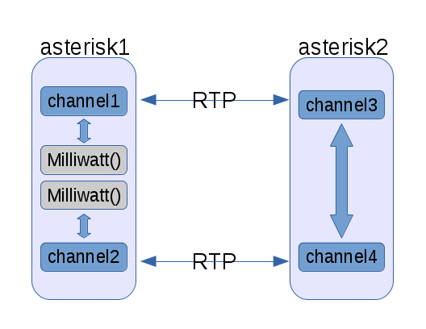

I'm at the [AstriCon](http://www.asterisk.org/community/astricon-user-conference) conference this week, which is a conference built around the [Asterisk](http://www.asterisk.org) open source project.  I worked on the Asterisk project for about 7 years before joining Red Hat to hack on cloud infrastructure.  I also helped write [a book](http://shop.oreilly.com/product/0636920025894.do) about it.  While I'm not working on Asterisk directly anymore, I still find it a very interesting project.  The community is full of great people.  Another reason I still pay attention is that communications infrastructure in general is an incredibly important use case for cloud infrastructure. The telco world is going through a rapid transformation with [SDN](https://www.opennetworking.org/sdn-resources/sdn-definition) and [NFV](https://blogs.gnome.org/markmc/2014/10/02/network-function-virtualization-the-opportunity-for-openstack-and-open-source/).

I did a keynote at AstriCon last year about open cloud infrastructure and its importance to Asterisk and communications infrastructure more broadly.  This year I did a talk more focused on networking and how some of the SDN trends apply to this project.  One of the things this conference has started doing is have a session called "dangerous demos".  The idea is for people to come up on stage and attempt a short (3-5 minute) live demo.  They give awards for various categories, including the most amusing case of a demo crashing and burning, as is often the case with live demos, especially using conference wifi.  Sounds fun, doesn't it?  I thought so.

Last Friday I set off to see what kind of demo I could whip up in an afternoon.  Here's what I came up with.

# Asterisk Call Bridging

Before getting to the demo, it's important to have some background on how Asterisk and some related technologies work.  Asterisk supports many different communications technologies.  It supports many different methods of traditional telephone network (PSTN) connectivity.  It also supports several Voice over IP (VoIP) protocols.  Any connection to the system via any of these technologies is represented as an Asterisk channel.

![[A Single Call Leg, Represented by a Single Channel]](images/singleChannel.png)

In some cases, there is only one channel.  This is when Asterisk itself is the endpoint of the call.  Some traditional examples would be something like voicemail or a system that implements an IVR such as an automated system to make payments on account.

It's also common to have two channels bridged together.  Imagine two phones on a call talking to each other.

![[Two Call Legs Represented by Two Channels]](images/twoChannels.png)

Architecturally, there are some layers involved here.  There is channel technology abstraction so that two channels using different technologies can still be bridged together.

![[Channel Technology and Abstract Channel Layers]](images/channelLayers.png)

This is an incredibly powerful part of Asterisk's architecture.  It lets you bridge new technologies like WebRTC to traditional telephony protocols.  However, bridging media streams through the abstract channel layer is not the most efficient way to do it if the two channels bridged together are actually the same technology.  So, Asterisk also has a concept of "native bridging".  This lets channel technology implementations implement more efficient ways of bridging.

SIP is the most commonly used VoIP protocol.  SIP is actually just a signaling (control) protocol.  The actual media streams are independent streams using the RTP protocol.  In some cases, the media streams can be sent directly between endpoints, but not always.  Asterisk sometimes has to transcode the media streams between two different codecs.  Another common case is that the streams may be fully compatible, but the system is used to put all streams through a controlled point (or set of points) at the edge of a company's network. This use case is sometimes referred to as a [Session Border Controller (SBC)](https://en.wikipedia.org/wiki/Session_border_controller).

An RTP stream is a good example of a painful scenario for packet processing performance.  It's a stream of small packets.  A typical RTP stream would be 50 UDP packets per second in each direction.  Each packet would hold 20 milliseconds of audio.  This can be different.  You can increase packet sizes, but it comes at the cost of increasing latency into the call. 20 ms of audio using [G.711](https://en.wikipedia.org/wiki/G.711) is 160 bytes of audio payload. There are several other codecs that may increase or decrease the audio payload. For example, 20 ms using [G.729](https://en.wikipedia.org/wiki/G.729) would be only 20 bytes of audio payload. Every packet also includes ethernet, IP, UDP, and RTP headers.

When two of these RTP streams are bridged in Asterisk, there is a thread handling the call that's polling on two UDP sockets.  When a packet comes in on one socket, it's processed if necessary and then written out to the other socket.

You can find a somewhat dated chapter that I wrote several years ago about Asterisk in the book ["Architecture of Open Source Applications"](http://aosabook.org/en/asterisk.html). I re-used some of the diagrams from that chapter for this post.

# The Demo

This demo is targeted at the case of Asterisk bridging two RTP streams that are fully compatible (same codec, same payload sizes, among other things).  During my talk about "SDN and Asterisk" yesterday, I talked about several things. One thing I talked about is how the Linux networking datapath is becoming more programmable and I talked about [Open vSwitch (OVS)](http://openvswitch.org/) as a specific example of that.

My demo consists of two VMs on my laptop (asterisk1 and asterisk2).  They both have a single vCPU and 1 GB of RAM.

asterisk1 serves as both endpoints of calls passing through asterisk2, so asterisk2 is doing bridging of compatible RTP streams.  Both ends of the call on asterisk1 are executing the Milliwatt() application, which just generates a tone. Each call looks like this:

[](https://russellbryantnet.files.wordpress.com/2015/10/call-topology.png)

I also customized the networking configuration on asterisk2. Instead of just having eth0, I have an OVS bridge named breth0 and eth0 is attached to that bridge.
```
[rbryant@asterisk2 ~]$ sudo ovs-vsctl show
e00ae5a3-5f81-476e-b40c-ff0c03817dea
    Bridge "breth0"
        fail_mode: standalone
        Port "eth0"
            Interface "eth0"
        Port "breth0"
            Interface "breth0"
                type: internal
    ovs_version: "2.4.0"

[rbryant@asterisk2 ~]$ ip addr list breth0
4: breth0@NONE: <BROADCAST,MULTICAST,UP,LOWER_UP> mtu 1500 qdisc noqueue state UNKNOWN group default 
    link/ether 52:54:00:31:cf:ce brd ff:ff:ff:ff:ff:ff
    inet 192.168.122.149/24 brd 192.168.122.255 scope global dynamic breth0
       valid_lft 2258sec preferred_lft 2258sec
    inet6 fe80::5054:ff:fe31:cfce/64 scope link 
       valid_lft forever preferred_lft forever

```
With this setup in place, I generated 100 calls, which means both asterisk1 and asterisk2 have 200 active channels.  On asterisk1:
```
asterisk1*CLI> core show channels
Channel              Location             State   Application(Data)             
SIP/asterisk2-000000 555@public:2         Up      Milliwatt()                   
SIP/asterisk2-000000 555@public:2         Up      Milliwatt()                   
SIP/asterisk2-000000 555@public:2         Up      Milliwatt()                   
...
200 active channels
200 active calls
200 calls processed

```
and on asterisk2:
```
asterisk2*CLI> core show channels
Channel              Location             State   Application(Data)             
SIP/asterisk1-000000 (None)               Up      AppDial((Outgoing Line))      
SIP/asterisk1-000000 555@public:1         Up      Dial(SIP/555@asterisk1)       
SIP/asterisk1-000000 (None)               Up      AppDial((Outgoing Line))   
SIP/asterisk1-000000 555@public:1         Up      Dial(SIP/555@asterisk1)          
...
200 active channels
100 active calls
100 calls processed

```
Why 200 channels? It's a nice round number. It also generates enough load on asterisk2 for the demo without making my laptop melt.

I mentioned earlier that in this case, Asterisk does the bridging of two RTP streams in a thread that's polling on two UDP sockets, reading packets from one, doing any necessary processing, and then writing it back out to the other socket. In this scenario, Asterisk is using roughly **25% of the vCPU** on asterisk2.

_What if in the simple forwarding case we could push this forwarding down into the kernel?_

To pull this off, first I needed to know about all of the RTP streams active on asterisk2. I actually need to know about pairs of RTP streams. When a packet arrives on one stream, I need to know what other stream it's associated with for sending it back out. Asterisk honestly does not make it very easy to get this information. You can get it using the CHANNEL() function. I probably could have written an [AMI](https://wiki.asterisk.org/wiki/pages/viewpage.action?pageId=4817239) script to get the info I needed. I'm not sure if I could have done it with [ARI](https://wiki.asterisk.org/wiki/pages/viewpage.action?pageId=29395573).  All of that sounded like too much work for my Friday afternoon hack.  The easiest way for me was to write a custom Asterisk C module that provided a CLI command to dump all of the info I wanted.  Here's the relevant code minus all of the module and CLI command boilerplate code:
```
	struct ast_channel *chan;
	struct ast_channel_iterator *chan_iter;
	chan_iter = ast_channel_iterator_all_new();
	for (; (chan = ast_channel_iterator_next(chan_iter)); ast_channel_unref(chan)) {
		char src[1024] = "";
		char dest[1024] = "";
		char src2[1024] = "";
		char dest2[1024] = "";
		struct ast_channel *chan2;
		ast_func_read(chan, "CHANNEL(rtpsource)", src, sizeof(src));
		ast_func_read(chan, "CHANNEL(rtpdest)", dest, sizeof(dest));
		chan2 = ast_bridged_channel(chan);
		ast_func_read(chan2, "CHANNEL(rtpsource)", src2, sizeof(src2));
		ast_func_read(chan2, "CHANNEL(rtpdest)", dest2, sizeof(dest2));
		ast_cli(a->fd, "%s %s %s %s\n", src, dest, src2, dest2);
	}
	ast_channel_iterator_destroy(chan_iter);

```
This code is a terrible hack that you'd never use on anything but this controlled environment, but it got me the info I wanted quickly.  The output looks something like this:
```
asterisk2*CLI> rtpstreams 
0.0.0.0:12164 192.168.122.130:10322 0.0.0.0:18364 192.168.122.130:19818
0.0.0.0:10364 192.168.122.130:15394 0.0.0.0:10110 192.168.122.130:17640
0.0.0.0:10110 192.168.122.130:17640 0.0.0.0:10364 192.168.122.130:15394
...

```
Now that we have the info we need about RTP stream pairs, we want to program the OVS bridge to do the RTP forwarding for us. We do that using the [OpenFlow](https://www.opennetworking.org/sdn-resources/openflow) protocol. In this case, we'll use the [ovs-ofctl](http://www.openvswitch.org/support/dist-docs-2.4/ovs-ofctl.8.html) command line utility to create and delete flows as needed.

I don't intend to go into any great detail about OpenFlow or how OVS works, but I think a really high level overview of flows is needed to be able to understand what happens next. OpenFlow lets you define a multi-stage packet processing pipeline. Each stage is a table. Processing starts in table 0. Processing may continue in other tables based on what actions are executed. Each flow in a table has a priority. The flow that gets executed in a table is the one with the highest priority that matches the packet. If multiple flows at the same priority match, which one gets executed is undefined.

What we want are flows that match an incoming RTP stream. In this demo we create flows with the following match conditions: the packet arrived on eth0, it's a UDP packet, and the UDP destination port number is N. When a packet matches one of our flows, we execute these actions: change the source and destination MAC addresses, change the source and destination IP addresses, change the source and destination UDP port numbers, and send the packet back out where it came from (eth0).

An example command to install a flow like this would be:
```
sudo ovs-ofctl -O OpenFlow13 add-flow breth0 priority=100,in_port=1,udp,udp_dst=10758,actions=mod_dl_src:52:54:00:31:cf:ce,mod_dl_dst:52:54:00:88:75:61,mod_nw_src:192.168.122.148,mod_nw_dst:192.168.122.130,mod_tp_src:14508,mod_tp_dst:10060,in_port

```
Of course, typing up 200 of those would be pretty tiring, so I just scripted it. Here is a simple Python script to generate all of the flows we need:
```
#!/usr/bin/env python

import os
import subprocess

asterisk1_mac = '52:54:00:88:75:61'
asterisk2_mac = '52:54:00:31:cf:ce'
asterisk1_ip = '192.168.122.130'
asterisk2_ip = '192.168.122.148'

output = subprocess.check_output(['sudo', 'asterisk', '-rx', 'rtpstreams'])
pairs = []
for l in output.splitlines():
    parts = l.split()
    if parts[0] == 'Setting':
        continue
    try:
        pair = ((parts[0].split(':')[1], parts[1].split(':')[1]),
                (parts[2].split(':')[1], parts[3].split(':')[1]))
    except:
        print "Failed to parse parts: %s" % parts
    reverse_pair = (pair[1], pair[0])
    if reverse_pair not in pairs:
        pairs.append(pair)

for p in pairs:
    os.system('sudo ovs-ofctl -O OpenFlow13 add-flow breth0 '
            'priority=100,in_port=1,udp,'
            'udp_dst=%s,actions=mod_dl_src:%s,mod_dl_dst:%s,'
            'mod_nw_src:%s,mod_nw_dst:%s,'
            'mod_tp_src:%s,mod_tp_dst:%s,in_port'
            % (p[0][0],
               asterisk2_mac, asterisk1_mac,
               asterisk2_ip, asterisk1_ip,
               p[1][0], p[1][1]))
    os.system('sudo ovs-ofctl -O OpenFlow13 add-flow breth0 '
            'priority=100,in_port=1,udp,'
            'udp_dst=%s,actions=mod_dl_src:%s,mod_dl_dst:%s,'
            'mod_nw_src:%s,mod_nw_dst:%s,'
            'mod_tp_src:%s,mod_tp_dst:%s,in_port'
            % (p[1][0],
               asterisk2_mac, asterisk1_mac,
               asterisk2_ip, asterisk1_ip,
               p[0][0], p[0][1]))

```
After running the above script, we can view the flows on breth0 using the following command:
```
[rbryant@asterisk2 ~]$ sudo ovs-ofctl -O OpenFlow13 dump-flows breth0 | grep table | cut -f4- -d' '
table=0, n_packets=591, n_bytes=126474, priority=100,udp,in_port=1,tp_dst=12164 actions=set_field:52:54:00:31:cf:ce->eth_src,set_field:52:54:00:88:75:61->eth_dst,set_field:192.168.122.148->ip_src,set_field:192.168.122.130->ip_dst,set_field:18364->udp_src,set_field:19818->udp_dst,IN_PORT
table=0, n_packets=588, n_bytes=125832, priority=100,udp,in_port=1,tp_dst=18364 actions=set_field:52:54:00:31:cf:ce->eth_src,set_field:52:54:00:88:75:61->eth_dst,set_field:192.168.122.148->ip_src,set_field:192.168.122.130->ip_dst,set_field:12164->udp_src,set_field:10322->udp_dst,IN_PORT
table=0, n_packets=588, n_bytes=125832, priority=100,udp,in_port=1,tp_dst=10364 actions=set_field:52:54:00:31:cf:ce->eth_src,set_field:52:54:00:88:75:61->eth_dst,set_field:192.168.122.148->ip_src,set_field:192.168.122.130->ip_dst,set_field:10110->udp_src,set_field:17640->udp_dst,IN_PORT
...

```
We can see in the n\_packets field of each flow that packets are matching all of our flows for forwarding RTP streams.

Here's what's really cool about this. After these flows are configured, Asterisk takes up **less than 1% of the vCPU** and the vCPU is 96-97% idle.

If we want to clear all of these flows and let RTP go back through Asterisk in userspace, we can run this script:
```
#!/bin/bash

for n in $(sudo ovs-ofctl -O OpenFlow13 dump-flows breth0 | grep "priority=100" | cut -f7 -d' ') ; do
    sudo ovs-ofctl -O OpenFlow13 del-flows --strict breth0 $n
done

```
At this point, the CPU usage jumps back up to where it was before.

# Future Work

This was just the result of an afternoon hack.  My primary goal was just to spur some interest in exploring how cool things happening in the SDN space could provide new ways of doing things.

If someone wanted to explore doing this in Asterisk more seriously, you could write some code in Asterisk that could speak OpenFlow to the local OVS bridge to create and delete flows as needed.  You could also imagine the possibility of speaking OpenFlow to a top-of-rack switch to push the forwarding out of the host completely, yet still through a controlled point in your network.

Another major caveat in this demo is that OVS and OpenFlow don't know what RTP is. There's no way (that I know of) to do any sort of validation on the packets before forwarding them along.  If one end started sending garbage, this setup would happily forward it along.  It's up to you how much that matters.  RTP devices are supposed to be built for the possibility of media streaming directly between endpoints, and in that case, there's nothing in the middle doing any checking of things.

If you were at AstriCon, thank you for coming to my talk and/or demo.  To everyone, I hope you found this interesting and that it inspires you to go off and learn more about this cool technology!
