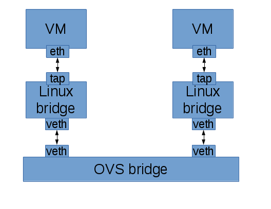

OpenStack Security Groups give you a way to define packet filtering policy that is implemented by the cloud infrastructure.  OVN and its OpenStack Neutron integration now includes support for security groups and this post discusses how it works.

# Existing OVS Support in OpenStack

It's worth looking at how this has been implemented with OVS in the past for OpenStack.  OpenStack's existing OVS integration (ML2+OVS) makes use of iptables to implement security groups.  Unfortunately, to make that work, we have to connect the VM to a tap device, put that on a linux bridge, and then connect the linux bridge to the OVS bridge using a veth pair so that we have a place to implement the iptables rules.  It's great that this works, but the extra layers are not ideal.

[](https://russellbryantnet.files.wordpress.com/2015/10/old-security-group-impl.png)

To get rid of all of the extra layers between the VM and OVS, we need to be able to build stateful firewall services in OVS directly.

# Enter OVS with Conntrack Integration

OVS integration with the kernel's connection tracker has been a hotly anticipated feature for OVS, and for good reason.  At the last OpenStack Summit in May, 2015, in Vancouver, there was a presentation that covered the benefits of this integration and how it will benefit security groups once available.  They were able to demonstrate **significant** performance benefit over the current approach of implementing security groups using iptables.  You can watch the presentation here:

http://www.youtube.com/watch?v=zR5rjObt-kc

The talk goes into some good detail about how this works.  However, at that time the conntrack integration was not yet finished and available for use.  Since then there has been fantastic progress!  The upstream kernel changes have been accepted and the userspace changes have all merged into the OVS project.  This will all be available in the next OVS release after 2.4.

The major piece left is completing a backport of the kernel changes.  Even though the openvswitch module is included in the upstream kernel, the OVS project maintains a version of the code that is backported to older kernels.  Backports of the conntrack integration are available as of writing in [this branch](https://github.com/justinpettit/ovs/tree/conntrack).

This functionality can now be used to build stateful services in OVS.  Without having to get into what this looks like in terms of detailed flows, here is an idea of what it lets you do in your packet processing pipeline.

1. In one stage, you can match all IP traffic and send it through the connection tracker.
2. In the next stage, you now have the connection tracker's state associated with this packet.
    1. For packets representing a new connection, you can use custom policy to decide if you'd like to accept the connection or not.  If you do accept it, you can tell the connection tracker to remember this connection.
    2. You know when packets are associated with existing connections and can allow them through.  This also applies to associated return traffic.
    3. You know if a packet is invalid because it's not the right type of packet for a new connection and doesn't match any existing known connection.

Now let's take a closer look at some real usage.

# OVN Stateful ACLs

An example use of OVS+conntrack is the implementation of ACLs in OVN.  ACLs provide a way to do distributed packet filtering for OVN networks. OVN ACLs are used to implement security groups for OpenStack Neutron.

I always find ovs-sandbox incredibly useful for exploring OVN features.  In fact, I've been writing an [OVN tutorial](https://github.com/openvswitch/ovs/blob/master/tutorial/OVN-Tutorial.md) that uses ovs-sandbox. Let's use ovs-sandbox to look at how OVN uses OVS+conntrack to implement ACLs.

I always run ovs-sandbox straight from the ovs git tree.  If you're starting from scratch, you'll first need to clone the ovs git repository. Note that you may also need to install some dependencies, including: `autoconf`, `automake`, `libtool`, `gcc`, `patch`, and `make`.
```
$ git clone https://github.com/openvswitch/ovs.git
$ cd ovs
$ ./configure
& make

```
Now that we have ovs compiled from git, we can run ovs-sandbox with OVN enabled from the git tree.
```
$ make sandbox SANDBOXFLAGS="--ovn"

```
Next, we need to create a simple OVN logical topology. We'll reuse a script from the OVN tutorial that creates a single logical switch with two logical ports. It then binds the two logical ports to the local ovs bridge in our sandbox. This script outputs all of the commands it executes.
```
$ ovn/env1/setup.sh 
+ ovn-nbctl lswitch-add sw0
+ ovn-nbctl lport-add sw0 sw0-port1
+ ovn-nbctl lport-add sw0 sw0-port2
+ ovn-nbctl lport-set-addresses sw0-port1 00:00:00:00:00:01
+ ovn-nbctl lport-set-addresses sw0-port2 00:00:00:00:00:02
+ ovn-nbctl lport-set-port-security sw0-port1 00:00:00:00:00:01
+ ovn-nbctl lport-set-port-security sw0-port2 00:00:00:00:00:02
+ ovs-vsctl add-port br-int lport1 -- set Interface lport1 external_ids:iface-id=sw0-port1
+ ovs-vsctl add-port br-int lport2 -- set Interface lport2 external_ids:iface-id=sw0-port2

```
We can view the logical topology using `ovn-nbctl`.
```
$ ovn-nbctl show
    lswitch caef7a2c-71fb-4af3-9cbc-589889606a2b (sw0)
        lport sw0-port1
            addresses: 00:00:00:00:00:01
        lport sw0-port2
            addresses: 00:00:00:00:00:02

```
We can also look at the physical topology to see that the two logical ports are bound to our single local chassis (hypervisor).
```
$ ovn-sbctl show
Chassis "56b18105-5706-46ef-80c4-ff20979ab068"
    Encap geneve
        ip: "127.0.0.1"
    Port_Binding "sw0-port1"
    Port_Binding "sw0-port2"

```
Now let's create some ACLs! A common use case would be creating a policy for a given port that looks something like this:

- Allow incoming ICMP requests and associated return traffic.
- Allow incoming SSH connections and associated return traffic.
- Drop other incoming IP traffic.

Here's how we'd create that policy for `sw0-port1` using ACLs.
```
$ ovn-nbctl acl-add sw0 to-lport 1002 'outport == "sw0-port1" && ip && icmp' allow-related
$ ovn-nbctl acl-add sw0 to-lport 1002 'outport == "sw0-port1" && ip && tcp && tcp.dst == 22' allow-related
$ ovn-nbctl acl-add sw0 to-lport 1001 'outport == "sw0-port1" && ip' drop

```
To verify what we've done, we can list the ACLs configured on the logical switch `sw0`.
```
$ ovn-nbctl acl-list sw0
  to-lport  1002 (outport == "sw0-port1" && ip && icmp) allow-related
  to-lport  1002 (outport == "sw0-port1" && ip && tcp && tcp.dst == 22) allow-related
  to-lport  1001 (outport == "sw0-port1" && ip) drop

```
Next we can look at how OVN integrates these ACLs into its Logical Flows.

As an aside, the more I work on and with OVN, the more convinced I am that Logical Flows are an incredibly powerful abstraction used in the OVN implementation. OVN first describes the packet processing pipeline in a structure that seems similar to OpenFlow, but only talks about logical network elements. This single logical packet processing pipeline is sent down to all hypervisors. A local controller on each hypervisor converts the logical flows into OpenFlow flows that reflect the local view of the world. The end result of all of this is that we're able to implement more and more complex features in logical flows without having to worry about the current physical topology.

Now that we have ACLs configured, there are new entries in the logical flow table in the stages `switch_in_pre_acl`, `switch_in_acl`, `switch_out_pre_acl`, and `switch_out_acl`. The full logical flow table at this point can be seen with `ovn-sbctl`.
```
$ ovn-sbctl lflow-list

```
Let's take a closer look at the `switch_out_pre_acl` and `switch_out_post_acl` stages of the egress logical flows for `sw0`.

In `switch_out_pre_acl`, we match IP traffic and put it through the connection tracker. This populates the connection state fields so that we can apply policy as appropriate.
```
    table=0(switch_out_pre_acl), priority=  100, match=(ip), action=(ct_next;)
    table=0(switch_out_pre_acl), priority=    0, match=(1), action=(next;)

```
In `switch_out_acl`, we allow packets associated with existing connections. We drop packets that are deemed to be invalid (such as non-SYN TCP packet not associated with an existing connection).
```
    table=1(switch_out_acl), priority=65535, match=(!ct.est && ct.rel && !ct.new && !ct.inv), action=(next;)
    table=1(switch_out_acl), priority=65535, match=(ct.est && !ct.rel && !ct.new && !ct.inv), action=(next;)
    table=1(switch_out_acl), priority=65535, match=(ct.inv), action=(drop;)

```
For new connections, we apply our configured ACL policy to decide whether to allow the connection or not. In this case, we’ll allow ICMP or SSH. Otherwise, we’ll drop the packet.
```
    table=1(switch_out_acl), priority= 2002, match=(ct.new && (outport == “sw0-port1” && ip && icmp)), action=(ct_commit; next;)
    table=1(switch_out_acl), priority= 2002, match=(ct.new && (outport == “sw0-port1” && ip && tcp && tcp.dst == 22)), action=(ct_commit; next;)
    table=1(switch_out_acl), priority= 2001, match=(outport == “sw0-port1” && ip), action=(drop;)

```
When using ACLs, the default policy is to allow and track IP connections. Based on our above policy, IP traffic directed at sw0-port1 will never hit this flow at priority 1.
```
    table=1(switch_out_acl), priority=    1, match=(ip), action=(ct_commit; next;)
    table=1(switch_out_acl), priority=    0, match=(1), action=(next;)

```
Currently, ovs-sandbox's fake datapath doesn't support conntrack integration so looking at OpenFlow at this point won't show the flows you'd expect. Let's jump over to a real OpenStack environment that implements security groups using OVN ACLs to dig deeper.

# Security Groups using OVN ACLs

The original OVS support in OpenStack could, and most likely will be updated to use conntrack integration to implement security groups.  In this example, we're using Neutron integration with OVN, which just merged support for implementing security groups using OVN ACLs. This example uses a single node devstack environment as described in [this document](http://docs.openstack.org/developer/networking-ovn/testing.html).

Let's start with a security group that implements a policy similar to the example we started with in ovs-sandbox. OpenStack security groups drop all traffic by default. The `default` security group shown here has been set up to allow all outbound IP traffic and associated return traffic. It also allows inbound ICMP requests and SSH connections.
```
$ neutron security-group-list
+--------------------------------------+---------+-----------------------+
| id                                   | name    | security_group_rules  |
+--------------------------------------+---------+-----------------------+
| a5e41dd4-4b15-4e68-a81d-45466bda3949 | default | egress, IPv4          |
|                                      |         | egress, IPv6          |
|                                      |         | ingress, IPv4, 22/tcp |
|                                      |         | ingress, IPv4, icmp   |
+--------------------------------------+---------+-----------------------+

```
The OVN Neutron driver translates this to the following OVN ACLs:
```
$ ovn-nbctl acl-list neutron-a920d5ef-eca8-4c4f-9c24-55e29e1c03d6
from-lport  1002 (inport == "a4a81c09-4e93-41e2-be83-cfe1f8b39f77" && ip4) allow-related
from-lport  1002 (inport == "a4a81c09-4e93-41e2-be83-cfe1f8b39f77" && ip6) allow-related
from-lport  1001 (inport == "a4a81c09-4e93-41e2-be83-cfe1f8b39f77" && ip) drop
  to-lport  1002 (outport == "a4a81c09-4e93-41e2-be83-cfe1f8b39f77" && ip4 && icmp4) allow-related
  to-lport  1002 (outport == "a4a81c09-4e93-41e2-be83-cfe1f8b39f77" && ip4 && tcp && tcp.dst >= 22 && tcp.dst <= 22) allow-related
  to-lport  1001 (outport == "a4a81c09-4e93-41e2-be83-cfe1f8b39f77" && ip) drop

```
In the ovs-sandbox example, we looked at the egress logical flows. Let's do that again to see the ACL stages which correspond to the `to-lport` direction ACLs.
```
$ ovn-sbctl lflow-list
...
  table=0(switch_out_pre_acl), priority=  100, match=(ip), action=(ct_next;)
  table=0(switch_out_pre_acl), priority=    0, match=(1), action=(next;)
...

```
We send all IP traffic through the connection tracker to initialize the `ct` state fields.
```
...
  table=1(switch_out_acl), priority=65534, match=(!ct.est && ct.rel && !ct.new && !ct.inv), action=(next;)
  table=1(switch_out_acl), priority=65534, match=(ct.est && !ct.rel && !ct.new && !ct.inv), action=(next;)

```
Traffic associated with existing connections is let through.
```
  table=1(switch_out_acl), priority=65534, match=(ct.inv), action=(drop;)

```
Invalid traffic is dropped.
```
  table=1(switch_out_acl), priority= 2002, match=(ct.new && (outport == "a4a81c09-4e93-41e2-be83-cfe1f8b39f77" && ip4 && icmp4)), action=(ct_commit; next;)
  table=1(switch_out_acl), priority= 2002, match=(ct.new && (outport == "a4a81c09-4e93-41e2-be83-cfe1f8b39f77" && ip4 && tcp && tcp.dst >= 22 && tcp.dst <= 22)), action=(ct_commit; next;)

```
These logical flows correspond to our ACLs. If the packet represents a new connection and that connection is IPv4 ICMP or SSH, we store info about the connection for later and allow it through.
```
  table=1(switch_out_acl), priority= 2001, match=(outport == "a4a81c09-4e93-41e2-be83-cfe1f8b39f77" && ip), action=(drop;)

```
This is our flow to drop traffic directed at our VM by default if it didn't match one of the rules above for ICMP or SSH.
```
  table=1(switch_out_acl), priority=    1, match=(ip), action=(ct_commit; next;)
  table=1(switch_out_acl), priority=    0, match=(1), action=(next;)
...

```
Otherwise, OVN defaults to allowing traffic through.

All of that is logical flows. Now let's look at how this is implemented in OpenFlow. The OpenFlow flows associated with ACLs in the egress logical flows are in OpenFlow tables 48 and 49.
```
$ sudo ovs-ofctl -O OpenFlow13 dump-flows br-int | cut -f4- -d' '
...
table=48, n_packets=22, n_bytes=2000, priority=100,ip,metadata=0x1 actions=ct(table=49,zone=NXM_NX_REG5[0..15])
table=48, n_packets=0, n_bytes=0, priority=100,ipv6,metadata=0x1 actions=ct(table=49,zone=NXM_NX_REG5[0..15])
table=48, n_packets=31490, n_bytes=3460940, priority=0,metadata=0x1 actions=resubmit(,49)
...
table=49, n_packets=0, n_bytes=0, priority=65534,ct_state=-new-est+rel-inv+trk,metadata=0x1 actions=resubmit(,50)
table=49, n_packets=14, n_bytes=1294, priority=65534,ct_state=-new+est-rel-inv+trk,metadata=0x1 actions=resubmit(,50)
table=49, n_packets=0, n_bytes=0, priority=65534,ct_state=+inv+trk,metadata=0x1 actions=drop
table=49, n_packets=0, n_bytes=0, priority=2002,ct_state=+new+trk,tcp,reg7=0x4,metadata=0x1,tp_dst=22 actions=ct(commit,zone=NXM_NX_REG5[0..15]),resubmit(,50)
table=49, n_packets=1, n_bytes=98, priority=2002,ct_state=+new+trk,icmp,reg7=0x4,metadata=0x1 actions=ct(commit,zone=NXM_NX_REG5[0..15]),resubmit(,50)
table=49, n_packets=0, n_bytes=0, priority=2001,ip,reg7=0x4,metadata=0x1 actions=drop
table=49, n_packets=0, n_bytes=0, priority=2001,ipv6,reg7=0x4,metadata=0x1 actions=drop
table=49, n_packets=7, n_bytes=608, priority=1,ip,metadata=0x1 actions=ct(commit,zone=NXM_NX_REG5[0..15]),resubmit(,50)
table=49, n_packets=0, n_bytes=0, priority=1,ipv6,metadata=0x1 actions=ct(commit,zone=NXM_NX_REG5[0..15]),resubmit(,50)
table=49, n_packets=31490, n_bytes=3460940, priority=0,metadata=0x1 actions=resubmit(,50)

```
This showed a pretty simple security group. Let's make the security group a bit more complicated, add a couple more VMs, and then see what the ACLs look like. Imagine we have some sort of web app running on these three VMs. We want to allow TCP ports 80 and 443 from the outside to these VMs. Imagine also that these apps present an internal only API for the VMs to talk to each other on port 8080. So, we want any VM using this security group to be able to access other VMs on this security group on port 8080, but no access from outside. While we're at it, we want everything to work on both IPv4 and IPv6. Here's what the resulting security group looks like.
```
$ neutron security-group-list
+--------------------------------------+---------+--------------------------------------------------------------------------------+
| id                                   | name    | security_group_rules                                                           |
+--------------------------------------+---------+--------------------------------------------------------------------------------+
| a5e41dd4-4b15-4e68-a81d-45466bda3949 | default | egress, IPv4                                                                   |
|                                      |         | egress, IPv6                                                                   |
|                                      |         | ingress, IPv4, 22/tcp                                                          |
|                                      |         | ingress, IPv4, 443/tcp                                                         |
|                                      |         | ingress, IPv4, 80/tcp                                                          |
|                                      |         | ingress, IPv4, 8080/tcp, remote_group_id: a5e41dd4-4b15-4e68-a81d-45466bda3949 |
|                                      |         | ingress, IPv4, icmp                                                            |
|                                      |         | ingress, IPv6, 22/tcp                                                          |
|                                      |         | ingress, IPv6, 443/tcp                                                         |
|                                      |         | ingress, IPv6, 80/tcp                                                          |
|                                      |         | ingress, IPv6, 8080/tcp, remote_group_id: a5e41dd4-4b15-4e68-a81d-45466bda3949 |
|                                      |         | ingress, IPv6, icmp                                                            |
+--------------------------------------+---------+--------------------------------------------------------------------------------+

```
Now, after booting a couple more VMs (for a total of 3), Neutron's OVN plugin has created the following ACLs. All of these will get automatically translated into logical flows, and then translated into OpenFlow flows by the local ovn-controller on each hypervisor as appropriate.
```
$ ovn-nbctl acl-list neutron-a920d5ef-eca8-4c4f-9c24-55e29e1c03d6
from-lport  1002 (inport == "62848020-ba3b-445c-a8a9-c13094648b34" && ip4) allow-related
from-lport  1002 (inport == "62848020-ba3b-445c-a8a9-c13094648b34" && ip6) allow-related
from-lport  1002 (inport == "6353ad55-f6e7-4bc5-9e5d-55e975b6736e" && ip4) allow-related
from-lport  1002 (inport == "6353ad55-f6e7-4bc5-9e5d-55e975b6736e" && ip6) allow-related
from-lport  1002 (inport == "a4a81c09-4e93-41e2-be83-cfe1f8b39f77" && ip4) allow-related
from-lport  1002 (inport == "a4a81c09-4e93-41e2-be83-cfe1f8b39f77" && ip6) allow-related
from-lport  1001 (inport == "62848020-ba3b-445c-a8a9-c13094648b34" && ip) drop
from-lport  1001 (inport == "6353ad55-f6e7-4bc5-9e5d-55e975b6736e" && ip) drop
from-lport  1001 (inport == "a4a81c09-4e93-41e2-be83-cfe1f8b39f77" && ip) drop
  to-lport  1002 (outport == "62848020-ba3b-445c-a8a9-c13094648b34" && ip4 && icmp4) allow-related
  to-lport  1002 (outport == "62848020-ba3b-445c-a8a9-c13094648b34" && ip4 && inport == {"6353ad55-f6e7-4bc5-9e5d-55e975b6736e","a4a81c09-4e93-41e2-be83-cfe1f8b39f77"} && tcp && tcp.dst >= 8080 && tcp.dst <= 8080) allow-related
  to-lport  1002 (outport == "62848020-ba3b-445c-a8a9-c13094648b34" && ip4 && tcp && tcp.dst >= 22 && tcp.dst <= 22) allow-related
  to-lport  1002 (outport == "62848020-ba3b-445c-a8a9-c13094648b34" && ip4 && tcp && tcp.dst >= 443 && tcp.dst <= 443) allow-related
  to-lport  1002 (outport == "62848020-ba3b-445c-a8a9-c13094648b34" && ip4 && tcp && tcp.dst >= 80 && tcp.dst <= 80) allow-related
  to-lport  1002 (outport == "62848020-ba3b-445c-a8a9-c13094648b34" && ip6 && icmp6) allow-related
  to-lport  1002 (outport == "62848020-ba3b-445c-a8a9-c13094648b34" && ip6 && inport == {"6353ad55-f6e7-4bc5-9e5d-55e975b6736e","a4a81c09-4e93-41e2-be83-cfe1f8b39f77"} && tcp && tcp.dst >= 8080 && tcp.dst <= 8080) allow-related
  to-lport  1002 (outport == "62848020-ba3b-445c-a8a9-c13094648b34" && ip6 && tcp && tcp.dst >= 22 && tcp.dst <= 22) allow-related
  to-lport  1002 (outport == "62848020-ba3b-445c-a8a9-c13094648b34" && ip6 && tcp && tcp.dst >= 443 && tcp.dst <= 443) allow-related
  to-lport  1002 (outport == "62848020-ba3b-445c-a8a9-c13094648b34" && ip6 && tcp && tcp.dst >= 80 && tcp.dst <= 80) allow-related
  to-lport  1002 (outport == "6353ad55-f6e7-4bc5-9e5d-55e975b6736e" && ip4 && icmp4) allow-related
  to-lport  1002 (outport == "6353ad55-f6e7-4bc5-9e5d-55e975b6736e" && ip4 && inport == {"62848020-ba3b-445c-a8a9-c13094648b34","a4a81c09-4e93-41e2-be83-cfe1f8b39f77"} && tcp && tcp.dst >= 8080 && tcp.dst <= 8080) allow-related
  to-lport  1002 (outport == "6353ad55-f6e7-4bc5-9e5d-55e975b6736e" && ip4 && tcp && tcp.dst >= 22 && tcp.dst <= 22) allow-related
  to-lport  1002 (outport == "6353ad55-f6e7-4bc5-9e5d-55e975b6736e" && ip4 && tcp && tcp.dst >= 443 && tcp.dst <= 443) allow-related
  to-lport  1002 (outport == "6353ad55-f6e7-4bc5-9e5d-55e975b6736e" && ip4 && tcp && tcp.dst >= 80 && tcp.dst <= 80) allow-related
  to-lport  1002 (outport == "6353ad55-f6e7-4bc5-9e5d-55e975b6736e" && ip6 && icmp6) allow-related
  to-lport  1002 (outport == "6353ad55-f6e7-4bc5-9e5d-55e975b6736e" && ip6 && inport == {"62848020-ba3b-445c-a8a9-c13094648b34","a4a81c09-4e93-41e2-be83-cfe1f8b39f77"} && tcp && tcp.dst >= 8080 && tcp.dst <= 8080) allow-related
  to-lport  1002 (outport == "6353ad55-f6e7-4bc5-9e5d-55e975b6736e" && ip6 && tcp && tcp.dst >= 22 && tcp.dst <= 22) allow-related
  to-lport  1002 (outport == "6353ad55-f6e7-4bc5-9e5d-55e975b6736e" && ip6 && tcp && tcp.dst >= 443 && tcp.dst <= 443) allow-related
  to-lport  1002 (outport == "6353ad55-f6e7-4bc5-9e5d-55e975b6736e" && ip6 && tcp && tcp.dst >= 80 && tcp.dst <= 80) allow-related
  to-lport  1002 (outport == "a4a81c09-4e93-41e2-be83-cfe1f8b39f77" && ip4 && icmp4) allow-related
  to-lport  1002 (outport == "a4a81c09-4e93-41e2-be83-cfe1f8b39f77" && ip4 && inport == {"62848020-ba3b-445c-a8a9-c13094648b34","6353ad55-f6e7-4bc5-9e5d-55e975b6736e"} && tcp && tcp.dst >= 8080 && tcp.dst <= 8080) allow-related
  to-lport  1002 (outport == "a4a81c09-4e93-41e2-be83-cfe1f8b39f77" && ip4 && tcp && tcp.dst >= 22 && tcp.dst <= 22) allow-related
  to-lport  1002 (outport == "a4a81c09-4e93-41e2-be83-cfe1f8b39f77" && ip4 && tcp && tcp.dst >= 443 && tcp.dst <= 443) allow-related
  to-lport  1002 (outport == "a4a81c09-4e93-41e2-be83-cfe1f8b39f77" && ip4 && tcp && tcp.dst >= 80 && tcp.dst <= 80) allow-related
  to-lport  1002 (outport == "a4a81c09-4e93-41e2-be83-cfe1f8b39f77" && ip6 && icmp6) allow-related
  to-lport  1002 (outport == "a4a81c09-4e93-41e2-be83-cfe1f8b39f77" && ip6 && inport == {"62848020-ba3b-445c-a8a9-c13094648b34","6353ad55-f6e7-4bc5-9e5d-55e975b6736e"} && tcp && tcp.dst >= 8080 && tcp.dst <= 8080) allow-related
  to-lport  1002 (outport == "a4a81c09-4e93-41e2-be83-cfe1f8b39f77" && ip6 && tcp && tcp.dst >= 22 && tcp.dst <= 22) allow-related
  to-lport  1002 (outport == "a4a81c09-4e93-41e2-be83-cfe1f8b39f77" && ip6 && tcp && tcp.dst >= 443 && tcp.dst <= 443) allow-related
  to-lport  1002 (outport == "a4a81c09-4e93-41e2-be83-cfe1f8b39f77" && ip6 && tcp && tcp.dst >= 80 && tcp.dst <= 80) allow-related
  to-lport  1001 (outport == "62848020-ba3b-445c-a8a9-c13094648b34" && ip) drop
  to-lport  1001 (outport == "6353ad55-f6e7-4bc5-9e5d-55e975b6736e" && ip) drop
  to-lport  1001 (outport == "a4a81c09-4e93-41e2-be83-cfe1f8b39f77" && ip) drop

```

# Possible Future Work

The biggest issue we have with this is just how new it is. It requires compiling and loading a custom version of the openvswitch kernel module from a custom branch of ovs. All of that is handled automatically by our devstack plugin, but it's not exactly what you'd want for production usage. As the kernel backport is finalized, we expect it to be backported into distro kernels as well, which will make this much more consumable. It will certainly be backported for RHEL 7 and its derivatives.

I'm looking forward to seeing what other features get implemented using OVS+conntrack, both for OVN and beyond!
