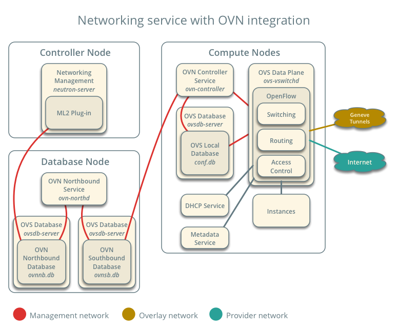

In January of 2015, the Open vSwitch team announced that they planned to start a new project within OVS called [OVN (Open Virtual Network)](http://networkheresy.com/2015/01/13/ovn-bringing-native-virtual-networking-to-ovs/).  The timing could not have been better for me as I was looking around for a new project.  I dove in with a goal of figuring out whether OVN could be a promising next generation of Open vSwitch integration for OpenStack and have been contributing to it ever since.

[OVS 2.6.0 has now been released](http://openvswitch.org/pipermail/announce/2016-September/000087.html) which includes the first non-experimental version of OVN.  As a community we have also built integration with [OpenStack](https://github.com/openstack/networking-ovn), [Docker](https://github.com/openvswitch/ovs/blob/master/INSTALL.Docker.md), and [Kubernetes](https://github.com/openvswitch/ovn-kubernetes).

OVN is a system to support virtual network abstraction. OVN complements the existing capabilities of OVS to add native support for virtual network abstractions, such as virtual L2 and L3 overlays and security groups.

Some high level features of OVN include:

- Provides virtual networking abstraction for OVS, implemented using L2 and L3 overlays, but can also manage connectivity to physical networks
- Supports flexible ACLs (security policies) [implemented using flows that use OVS connection tracking](http://blog.russellbryant.net/2015/10/22/openstack-security-groups-using-ovn-acls/)
- Native support for distributed L3 routing using OVS flows, with support for both IPv4 and IPv6
- ARP and IPv6 Neighbor Discovery suppression for known IP-MAC bindings
- Native support for NAT and load balancing using OVS connection tracking
- Native fully distributed support for DHCP
- Works with any OVS datapath (such as the default Linux kernel datapath, DPDK, or Hyper-V) that supports all required features (namely Geneve tunnels and OVS connection tracking. See the datapath feature list in the [FAQ](https://github.com/openvswitch/ovs/blob/master/FAQ.md#general) for details.)
- Supports L3 gateways from logical to physical networks
- Supports software-based L2 gateways
- Supports TOR (Top of Rack) based L2 gateways that implement the hardware\_vtep schema
- Can provide networking for both VMs and containers running inside of those VMs, without a second layer of overlay networking

Support for large scale deployments is a key goal of OVN.  So far, we have seen physical deployments of several hundred nodes.  We've also done some larger scale testing by simulating deployments of thousands of nodes using the [ovn-scale-test](https://github.com/openvswitch/ovn-scale-test) project.

# OVN Architecture

## Components

OVN is a distributed system.  There is a local SDN controller that runs on every host, called [ovn-controller](http://openvswitch.org/support/dist-docs/ovn-controller.8.html).  All of the controllers are coordinated through the [southbound database](http://openvswitch.org/support/dist-docs/ovn-sb.5.html).  There is also a centralized component, [ovn-northd](http://openvswitch.org/support/dist-docs/ovn-northd.8.html), that processes high level configuration placed in the [northbound database](http://openvswitch.org/support/dist-docs/ovn-nb.5.html). OVN's architecture is discussed in detail in the [ovn-architecture document](http://openvswitch.org/support/dist-docs/ovn-architecture.7.html).

OVN uses databases for its control plane. One benefit is that scaling databases is a well understood problem.  OVN currently makes use of [ovsdb-server](http://openvswitch.org/support/dist-docs/ovsdb-server.1.html) as its database.  The use of ovsdb-server is particularly convenient within OVN as it introduces no new dependencies since ovsdb-server is already in use everywhere OVS is used.  However, the project is also currently considering adding support for, or fully migrating to etcd v3, since v3 includes all of the features we wanted for our system.

We have also found that this database driven architecture is much more reliable than RPC based approaches taken in other systems we have worked with.  In OVN, each instance of ovn-controller is always working with a consistent snapshot of the database.  It maintains a connection to the database and gets a feed of relevant updates as they occur.  If connectivity is interrupted, ovn-controller will always catch back up to the latest consistent snapshot of the relevant database contents and process them.

## Logical Flows

OVN introduces a new intermediary representation of the system's configuration called logical flows.  A typical centralized model would take the desired high level configuration, calculate the required physical flows for the environment, and program the switches on each node with those physical flows.  OVN breaks this problem up into a couple of steps.  It first calculates logical flows, which are similar to physical OpenFlow flows in their expressiveness, but operate only on logical entities.  The logical flows for a given network are identical across the whole environment.  These logical flows are then distributed to the local controller on each node, ovn-controller, which converts logical flows to physical flows.  This means that some deployment-wide computation is done once and the node-specific computation is fully distributed and done local to the node it applies to.

Logical flows have also proven to be powerful when it comes to implementing features.  As we've built up support for new capabilities in the logical flow syntax, most features are now implemented at the logical flow layer, which is much easier to work with than physical flows.

## Data Path

OVN implements features natively in OVS wherever possible.  One such example is the implementation of security policies using OVS+conntrack integration.  I [wrote about this in more detail previously](https://blog.russellbryant.net/2015/10/22/openstack-security-groups-using-ovn-acls/).  This approach has led to significant data path performance improvements as compared to previous approaches.  The other area this makes a huge impact is how OVN implements distributed L3 routing.  Instead of combining OVS with several other layers of technology, we provide L3 routing purely with OVS flows.  In addition to the performance benefits, we also find this to be much simpler than the alternative approaches that other projects have taken to build routing on top of OVS.  Another benefit is that all of these features work with OVS+DPDK since we don't rely on Linux kernel-specific features.

# Integrations

## OpenStack

Integration with OpenStack was developed in parallel with OVN itself.  The OpenStack [networking-ovn](https://github.com/openstack/networking-ovn) project contains an ML2 driver for OpenStack Neutron that provides integration with OVN.  It differs from Neutron's original OVS integration in some significant ways.  It no longer makes use of the Neutron Python agents as all equivalent functionality has been moved into OVN.  As a result, it no longer uses RabbitMQ.  Neutron's use of RabbitMQ for RPC has been replaced by OVN's database driven control plane.  The following diagram gives a visual representation of the architecture of Neutron using OVN.  Even more detail can be found in our documented [reference architecture](http://docs.openstack.org/developer/networking-ovn/refarch/refarch.html).

There are a few different ways to test out OVN integration with OpenStack.  The most popular development environment for OpenStack is called DevStack.  We provide integration with DevStack, including some instructions on [how to do simple testing with DevStack](http://docs.openstack.org/developer/networking-ovn/testing.html).

If you're a Vagrant user, networking-ovn includes a [vagrant setup](https://github.com/openstack/networking-ovn/tree/master/vagrant) for doing multi-node testing of OVN using DevStack.

The OpenStack TripleO deployment project includes support for OVN as of the OpenStack Newton release.

Finally, we also have [manual installation instructions](http://docs.openstack.org/developer/networking-ovn/install.html) to help with integrating OVN into your own OpenStack environment.

## Kubernetes

There is active development on a [CNI plugin for OVN to be used with Kubernetes](https://github.com/openvswitch/ovn-kubernetes).  One of the key goals for OVN was to have containers in mind from the beginning, and not just VMs.  Some important features were added to OVN to help support this integration.  For example, ovn-kubernetes makes use of OVN's load balancing support, which is built on native load balancing support in OVS.

The README in that repository contains an overview, as well as instructions on how to use it.  There is also support for [running an ovn-kubernetes environment using vagrant](https://github.com/openvswitch/ovn-kubernetes/tree/master/vagrant).

## Docker

There is [OVN integration with Docker networking](https://github.com/openvswitch/ovs/blob/master/INSTALL.Docker.md), as well.  This currently resides in the main OVS repo, though it could be split out into its own repository in the future, similar to ovn-kubernetes.

# Getting Involved

We would love feedback on your experience trying out OVN.  Here are some ways to get involved and provide feedback:

- OVS and OVN are discussed on the [OVS discuss mailing list](http://mail.openvswitch.org/mailman/listinfo/discuss).
- OVN development occurs on the [OVS development mailing list](http://mail.openvswitch.org/mailman/listinfo/dev).
- OVS and OVN are discussed in #openvswitch on the Freenode IRC network.
- Development of the OVN Kubernetes integration occurs on [Github](https://github.com/openvswitch/ovn-kubernetes) but can be discussed on either the Open vSwitch IRC channel or discuss mailing list.
- Integration of OVN with OpenStack is discussed in #openstack-neutron-ovn on Freenode, as well as the [OpenStack development mailing list](http://lists.openstack.org/cgi-bin/mailman/listinfo/openstack-dev).
