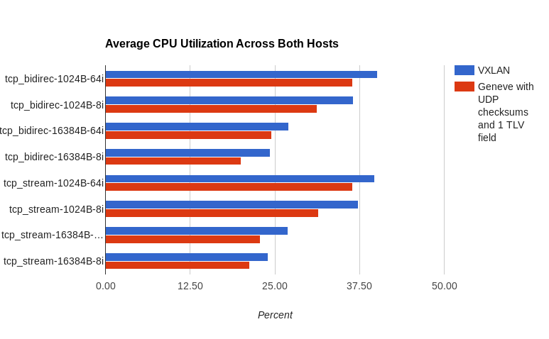
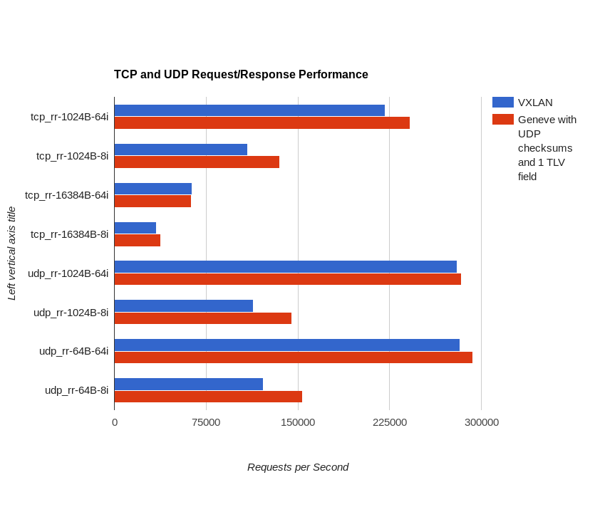
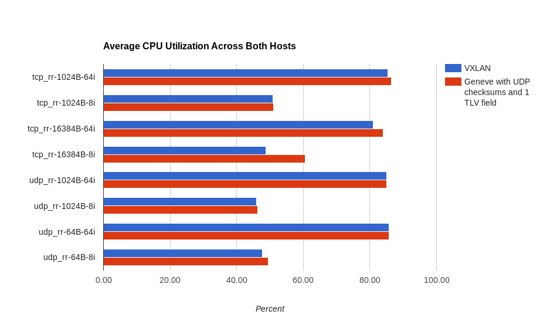

One of the early design decisions made in OVN was to only support tunnel encapsulation protocols that provided the ability to include additional metadata beyond what fits in the VNI field of a VXLAN header.  OVN mostly uses the Geneve protocol and only uses VXLAN for integration with TOR switches that support the hardware\_vtep OVSDB schema to use as L2 gateways between logical and physical networks.

Many people wonder when they first learn of this design decision, **"why not VXLAN?"**  In particular, what about performance?  Some hardware has VXLAN offload capabilities.  Are we going to suffer a performance hit when using Geneve?

These are very good questions, so I set off to come up with a good answer.

# Why Geneve?

One of the key implementation details of OVN is [Logical Flows](https://blog.russellbryant.net/2016/11/11/ovn-logical-flows-and-ovn-trace/).  Instead of programming new features using OpenFlow, we primarily use Logical Flows.  This makes feature development easier because we don’t have to worry about the physical location of resources on the network when writing flows.  We are able to write flows as if the entire deployment was one giant switch instead of 10s, 100s, or 1000s of switches.

Part of the implementation of this is that in addition to passing a network ID over a tunnel, we also pass IDs for the logical source and destination ports.  With Geneve, OVN will identify the network using the VNI field and will use an additional 32-bit TLV to specify both the source and destination logical ports.

Of course, by using an extensible protocol, we also have the capability to add more metadata for advanced features in the future.

More detail about OVN’s use of Geneve TLVs can be found in the “Tunnel Encapsulations” sub-section of “Design Decisions” in the [OVN Architecture](http://openvswitch.org/support/dist-docs/ovn-architecture.7.html) document.

# Hardware Offload

Imagine a single UDP packet being sent between two VMs.  The headers might look something like:

- Ethernet header
- IP header
- UDP header
- Application payload

When we encapsulate this packet in a tunnel, what gets sent over the physical network ends up looking like this:

- **Outer Ethernet header**
- **Outer IP header**
- **Outer UDP header**
- **Geneve or VXLAN Header**
- **Application payload: (Inner packet from VM 1 to VM 2)**
    - Inner Ethernet header
    - Inner IP header
    - Inner UDP header
    - Application payload

There are **many** more NIC capabilities than what’s discussed here, but I'll focus on some key features related to tunnel performance.

Some offload capabilities are not actually VXLAN specific.  For example, the commonly referred to “tx-udp\_tnl-segmentation” offload applies to both VXLAN and Geneve.  This is where the kernel is able to send a large amount of data to the NIC at once and the NIC breaks it up into TCP segments and then adds both the inner and outer headers. The performance boost comes from not having to do the same thing in software.  This offload helps significantly with TCP throughput over a tunnel.

You can check to see if a NIC has support for "tx-udp\_tnl-segmentation" with ethtool.  For example, on a host that doesn't support it:
```
$ ethtool -k eth0 | grep tnl-segmentation
tx-udp_tnl-segmentation: off [fixed]
```
or on a host that does support it and has it enabled:
```
$ ethtool -k eth0 | grep tnl-segmentation
tx-udp_tnl-segmentation: on
```
There is a type of offload that is VXLAN specific, and that is RSS (Receive Side Scaling).  This is when the NIC is able to look inside a tunnel to identify the inner flows and efficiently distribute them among multiple receive queues (to be processed across multiple CPUs).  Without this capability, a VXLAN tunnel looks like a single stream and will go into a single receive queue.

You may wonder, "does my NIC support VXLAN or Geneve RSS?"  Unfortunately, there does not appear to be an easy way to check this with a command.  The best method I've seen is to read the driver source code or dig through vendor documentation.

Since the VXLAN specific offload capability is on the receive side, it’s important to look at what other techniques can be used to improve receive side performance.  One such option is RPS (Receive Packet Steering).  RPS is the same concept as RSS, but done in software.  Packets are distributed among CPUs in software before fully processing them.

Another optimization is that OVN enables UDP checksums on Geneve tunnels by default.  Adding this checksum actually **improves** performance on the receive side.  This is because of some more recent optimizations implemented in the kernel.  When a Geneve packet is received, this outer UDP checksum will be verified by the NIC.  This checksum verification will be reported to the kernel.  Since the outer UDP checksum has been verified, the kernel uses this fact to skip having to calculate and verify any checksums of the inner packet.  Without enabling the outer UDP checksum and letting the NIC verify it, the kernel is doing more checksum calculation in software.  It’s expected that this regains significant performance on the receive side.

# Performance Testing

In the last section, we identified that there is an offload capability (RSS) that is VXLAN specific.  Some NICs support RSS for VXLAN and Geneve, some for VXLAN only, and others don't support it at all.

This raises an important question: **On systems with NICs that do RSS for VXLAN only, can we match performance with Geneve?**

On the surface, we expect Geneve performance to be worse.  However, because of other optimizations, we really need to check to see how much RSS helps.

After some investigation of driver source code (Thanks, Lance Richardson!), we found that the following drivers had RSS support for VXLAN, but not Geneve.

- mlx4\_en (Mellanox)
- mlx5\_core (Mellanox)
- qlcnic (QLogic)
- be2net (HPE Emulex)

To help answer our question above, we did some testing on machines with one of these NICs.

## Hardware

The testing was done between two servers.  Both had a Mellanox NIC using the mlx4\_en driver.  The NICs were connected back-to-back.

The servers had the following specs:

- HP Z220
- Intel(R) Core(TM) i5-3470 CPU @ 3.20GHz (1 socket, 4 cores)
- Memory: 4096 MB

## Software

- Operating System: RHEL 7.3
- Kernel: 4.10.2-1.el7.elrepo.x86\_64
    - Used a newer kernel to ensure we had the latest optimizations available.
    - Installed via a package from [http://elrepo.org/tiki/kernel-ml](http://elrepo.org/tiki/kernel-ml)
- OVS: openvswitch-2.6.1-4.1.git20161206.el7.x86\_64
    - From [RDO](https://www.rdoproject.org/)
- tuned profile: throughput-performance

## Test Overview

- Create two tunnels between the hosts: one VXLAN and one Geneve.
    - With Geneve, add 1 TLV field to match the amount of additional metadata sent across the tunnel with OVN.
- Use [pbench-uperf](https://github.com/distributed-system-analysis/pbench) to run tests
- Traffic
    - TCP
    - UDP (with different packet sizes, 64 and 1024 byte)
    - Multiple concurrent streams (8 and 64)
- All tests are run 3 times.  Results must be within 5% stddev or the 3 runs will be discarded and will run again.  This ensures reasonably consistent and reliable results.

# Summary of Results

TCP Throughput

- We reach line rate with both VXLAN and Geneve.  Differences are observed in CPU consumption where we see Geneve consistently using less CPU.



<table><tbody><tr><td colspan="4"><span style="font-weight:400;">Average CPU Utilization Across Both Hosts</span></td></tr><tr><td><span style="font-weight:400;">Scenario</span></td><td><b>VXLAN - Average CPU Utilization (Percent)</b></td><td><b>Geneve w/ UDP checksums and 1 TLV Field - Average CPU Utilization (Percent)</b></td><td><b>Average CPU Utilization Increase (Percent)</b></td></tr><tr><td><span style="font-weight:400;">tcp_bidirec-1024B-64i</span></td><td><span style="font-weight:400;">40.17</span></td><td><span style="font-weight:400;">36.45</span></td><td bgcolor="#96FF96"><span style="font-weight:400;">-3.72</span></td></tr><tr><td><span style="font-weight:400;">tcp_bidirec-1024B-8i</span></td><td><span style="font-weight:400;">36.62</span></td><td><span style="font-weight:400;">31.26</span></td><td bgcolor="#96FF96"><span style="font-weight:400;">-5.35</span></td></tr><tr><td><span style="font-weight:400;">tcp_bidirec-16384B-64i</span></td><td><span style="font-weight:400;">27.02</span></td><td><span style="font-weight:400;">24.52</span></td><td bgcolor="#96FF96"><span style="font-weight:400;">-2.50</span></td></tr><tr><td><span style="font-weight:400;">tcp_bidirec-16384B-8i</span></td><td><span style="font-weight:400;">24.34</span></td><td><span style="font-weight:400;">20.06</span></td><td bgcolor="#96FF96"><span style="font-weight:400;">-4.28</span></td></tr><tr><td><span style="font-weight:400;">tcp_stream-1024B-64i</span></td><td><span style="font-weight:400;">39.75</span></td><td><span style="font-weight:400;">36.53</span></td><td bgcolor="#96FF96"><span style="font-weight:400;">-3.22</span></td></tr><tr><td><span style="font-weight:400;">tcp_stream-1024B-8i</span></td><td><span style="font-weight:400;">37.36</span></td><td><span style="font-weight:400;">31.50</span></td><td bgcolor="#96FF96"><span style="font-weight:400;">-5.87</span></td></tr><tr><td><span style="font-weight:400;">tcp_stream-16384B-64i</span></td><td><span style="font-weight:400;">26.92</span></td><td><span style="font-weight:400;">22.83</span></td><td bgcolor="#96FF96"><span style="font-weight:400;">-4.09</span></td></tr><tr><td><span style="font-weight:400;">tcp_stream-16384B-8i</span></td><td><span style="font-weight:400;">24.01</span></td><td><span style="font-weight:400;">21.32</span></td><td bgcolor="#96FF96"><span style="font-weight:400;">-2.69</span></td></tr><tr><td colspan="3"><b>Average CPU Utilization Increase (Percent) Across All Scenarios</b></td><td bgcolor="#96FF96"><b>-3.96</b></td></tr></tbody></table>

## TCP and UDP Request/Response Rate (RR)

- We see higher CPU usage in these scenarios with Geneve, but an even higher relative amount of requests per second processed, leading us to conclude that Geneve is performing better overall in this case, as well.



<table><tbody><tr><td colspan="4"><span style="font-weight:400;">Request / Response Performance</span></td></tr><tr><td><span style="font-weight:400;">Scenario</span></td><td><b>VXLAN - Requests per Second</b></td><td><b>Geneve w/ UDP checksums and 1 TLV Field - Requests Per Second</b></td><td><b>Percent Increase with Geneve</b></td></tr><tr><td><span style="font-weight:400;">tcp_rr-1024B-64i</span></td><td><span style="font-weight:400;">221400</span></td><td><span style="font-weight:400;">241900</span></td><td bgcolor="#96ff96"><span style="font-weight:400;">9.26%</span></td></tr><tr><td><span style="font-weight:400;">tcp_rr-1024B-8i</span></td><td><span style="font-weight:400;">109000</span></td><td><span style="font-weight:400;">135000</span></td><td bgcolor="#96ff96"><span style="font-weight:400;">23.85%</span></td></tr><tr><td><span style="font-weight:400;">tcp_rr-16384B-64i</span></td><td><span style="font-weight:400;">63400</span></td><td><span style="font-weight:400;">63060</span></td><td bgcolor="#FF7a7a"><span style="font-weight:400;">-0.54%</span></td></tr><tr><td><span style="font-weight:400;">tcp_rr-16384B-8i</span></td><td><span style="font-weight:400;">34330</span></td><td><span style="font-weight:400;">37950</span></td><td bgcolor="#96ff96"><span style="font-weight:400;">10.54%</span></td></tr><tr><td><span style="font-weight:400;">udp_rr-1024B-64i</span></td><td><span style="font-weight:400;">280300</span></td><td><span style="font-weight:400;">283600</span></td><td bgcolor="#96ff96"><span style="font-weight:400;">1.18%</span></td></tr><tr><td><span style="font-weight:400;">udp_rr-1024B-8i</span></td><td><span style="font-weight:400;">113600</span></td><td><span style="font-weight:400;">145200</span></td><td bgcolor="#96ff96"><span style="font-weight:400;">27.82%</span></td></tr><tr><td><span style="font-weight:400;">udp_rr-64B-64i</span></td><td><span style="font-weight:400;">282300</span></td><td><span style="font-weight:400;">293100</span></td><td bgcolor="#96ff96"><span style="font-weight:400;">3.83%</span></td></tr><tr><td><span style="font-weight:400;">udp_rr-64B-8i</span></td><td><span style="font-weight:400;">121600</span></td><td><span style="font-weight:400;">154000</span></td><td bgcolor="#96ff96"><span style="font-weight:400;">26.64%</span></td></tr><tr><td colspan="3"><b>Average Percentage Increase with Geneve</b></td><td bgcolor="#96ff96"><b>12.82%</b></td></tr></tbody></table>



<table><tbody><tr><td colspan="4"><span style="font-weight:400;">Average CPU Utilization Across Both Hosts</span></td></tr><tr><td><span style="font-weight:400;">Scenario</span></td><td><b>VXLAN Average CPU Utilization (Percent)</b></td><td><b>Geneve w/ UDP checksums Average CPU Utilization (Percent)</b></td><td><b>Average CPU Utilization Increase (Percent)</b></td></tr><tr><td><span style="font-weight:400;">tcp_rr-1024B-64i</span></td><td><span style="font-weight:400;">85.39</span></td><td><span style="font-weight:400;">86.49</span></td><td bgcolor="#FF7a7a"><span style="font-weight:400;">1.11</span></td></tr><tr><td><span style="font-weight:400;">tcp_rr-1024B-8i</span></td><td><span style="font-weight:400;">50.94</span></td><td><span style="font-weight:400;">51.06</span></td><td bgcolor="#FF7a7a"><span style="font-weight:400;">0.13</span></td></tr><tr><td><span style="font-weight:400;">tcp_rr-16384B-64i</span></td><td><span style="font-weight:400;">81.02</span></td><td><span style="font-weight:400;">84.04</span></td><td bgcolor="#FF7a7a"><span style="font-weight:400;">3.02</span></td></tr><tr><td><span style="font-weight:400;">tcp_rr-16384B-8i</span></td><td><span style="font-weight:400;">48.84</span></td><td><span style="font-weight:400;">60.58</span></td><td bgcolor="#FF7a7a"><span style="font-weight:400;">11.74</span></td></tr><tr><td><span style="font-weight:400;">udp_rr-1024B-64i</span></td><td><span style="font-weight:400;">85.10</span></td><td><span style="font-weight:400;">85.05</span></td><td bgcolor="#96ff96"><span style="font-weight:400;">-0.05</span></td></tr><tr><td><span style="font-weight:400;">udp_rr-1024B-8i</span></td><td><span style="font-weight:400;">45.95</span></td><td><span style="font-weight:400;">46.38</span></td><td bgcolor="#FF7a7a"><span style="font-weight:400;">0.43</span></td></tr><tr><td><span style="font-weight:400;">udp_rr-64B-64i</span></td><td><span style="font-weight:400;">85.65</span></td><td><span style="font-weight:400;">85.71</span></td><td bgcolor="#FF7a7a"><span style="font-weight:400;">0.06</span></td></tr><tr><td><span style="font-weight:400;">udp_rr-64B-8i</span></td><td><span style="font-weight:400;">47.66</span></td><td><span style="font-weight:400;">49.43</span></td><td bgcolor="#FF7a7a"><span style="font-weight:400;">1.77</span></td></tr><tr><td colspan="3"><b>Average CPU Utilization Increase (Percent) Across All Scenarios</b></td><td bgcolor="#FF7a7a"><b>2.28</b></td></tr></tbody></table>

# Conclusion

Using optimizations available in newer versions of the Linux kernel, we are seeing **better** performance with Geneve than VXLAN, despite this hardware having some VXLAN specific offload capabilities.

Based on these results, I feel that OVN's reliance on Geneve as its standard tunneling protocol is acceptable.  It provides additional capabilities while maintaining good performance, even on hardware that has VXLAN specific RSS support.

Adding general VXLAN support to OVN would not be trivial and would introduce a significant ongoing maintenance burden.  Testing done so far does not justify that cost.
